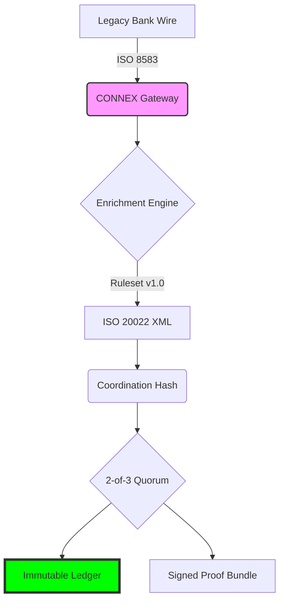

---

**CONNEX** is a neutral coordination layer designed for cross-institutional payments. It provides a cryptographically verifiable bridge between legacy ISO 8583 banking systems and modern ISO 20022 regulatory frameworks.

### The Problem
Traditional payment systems suffer from "settlement opacity": legacy ISO 8583 messages lack the rich context required for modern regulatory compliance (ISO 20022), leading to manual reconciliation, high dispute rates, and regulatory friction in cross-border and cross-institutional flows.

### The Solution
CONNEX intercepts legacy messages, enriches them into validated ISO 20022 XML, and seals every enrichment decision with a 2-of-3 Ed25519 quorum of independent witness nodes. Every transaction produces an immutable proof bundle that can be verified by any third party without access to the core gateway.



---

## Comparison: Industry Standards

| Feature | Legacy Settlement | CONNEX Coordination |
| :--- | :--- | :--- |
| **Data Format** | ISO 8583 (Limited) | **ISO 20022 (Rich/Validated)** |
| **Verification** | Manual Bank Audit | **Automated Cryptographic Proof** |
| **Dispute Time** | 72h - 45 Days | **Real-time (< 50ms)** |
| **Trust Model** | Centralized | **Distributed Quorum (2-of-3)** |
| **Ledger Type** | Opaque / Mutable | **Transparent / Append-Only** |

---

## Run the Demo (5 Minutes)

CONNEX is designed for transparency. You can build and run a full coordination cycle with real cryptographic signatures on a clean machine.

**Prerequisites:**
- Go 1.22+
- Python 3.x
- SQLite3

```bash
# 1. Clone and build
make build

# 2. Run the end-to-end demo
# This starts 3 witnesses, 1 gateway, processes 10 transactions, 
# verifies them with Python, and tests tamper detection.
make demo
```

---

## Technical Architecture

The CONNEX runtime consists of six isolated processes:

1.  **Gateway (Go):** The core coordinator. Parses ISO 8583, runs the rules engine, assembles ISO 20022 XML, and handles the witness quorum.
2.  **Witness Alpha, Beta, Gamma (Go):** Three independent signing nodes running on ports 8091-8093. Each manages its own Ed25519 keypair.
3.  **Storage (SQLite):** An append-only ledger enforced by database-level triggers.
4.  **Independent Verifier (Python):** A standalone tool that recomputes hashes and verifies signatures to prove data integrity.

### Data Flow
1.  **POST** ISO 8583 (base64) to Gateway.
2.  Gateway **Parses** legacy data.
3.  **Enrichment Engine** applies 30+ deterministic rules (CBK regulatory codes, purpose codes).
4.  **XML Assembler** generates `pacs.008.001.08` and validates against XSD.
5.  Gateway computes **Coordination Hash** (SHA-256 of input + output + previous link).
6.  Gateway requests **Signatures** from 3 witnesses; requires 2 for quorum.
7.  **Proof Bundle** is returned and stored in the append-only ledger.

---

## Reproducible Proof

The `verify/verify.py` script is the source of truth for the technical claim. It does not import gateway code. It uses `pynacl` to prove:
- **Integrity:** The enriched XML has not been modified since signing.
- **Linkage:** The record is correctly linked to the previous state in the hash chain.
- **Authority:** At least two independent witnesses signed the specific coordination hash.

```bash
# Verify a specific bundle
python3 verify/verify.py bench/results/demo-bundles/CX-2026...json keys/
```

---

## Documentation
- [CONNEX Architecture Deep-Dive](docs/ARCHITECTURE.md) — Threat model and process deep-dive.
- [Design Decisions](DESIGN_DECISIONS.md) — Rationale for Go, SQLite, Ed25519.
- [Benchmark Results](BENCHMARKS.md) — Performance measurements and manifest SHAs.
- [Corpus Methodology](corpus/v1.0/README.md) — How the 500 synthetic transactions were constructed.

---
**License:** Apache 2.0
**Disclaimer:** This is a Research Demonstrator. Synthetic corpus used for performance and logic verification.
