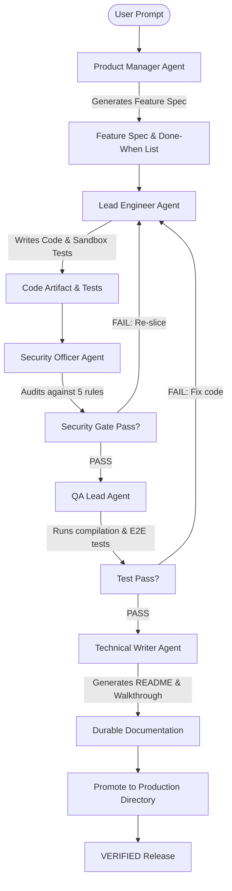
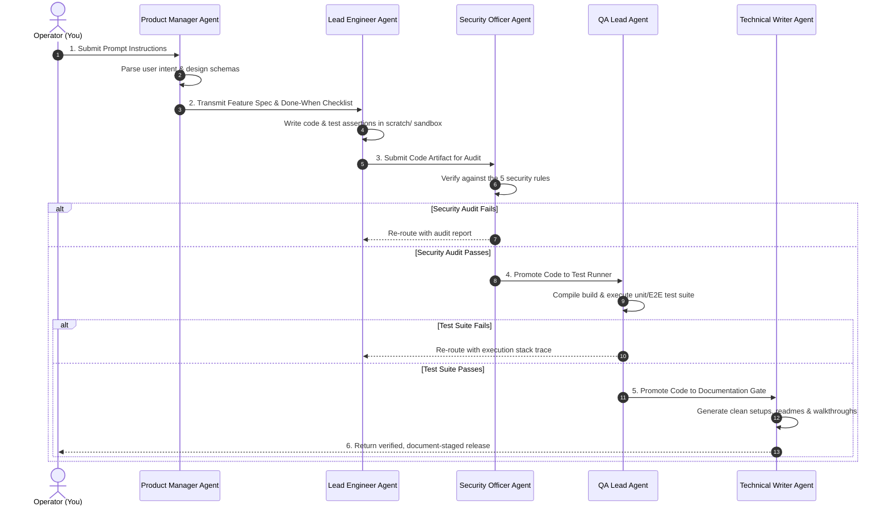
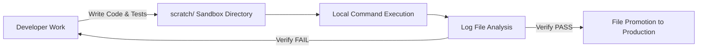
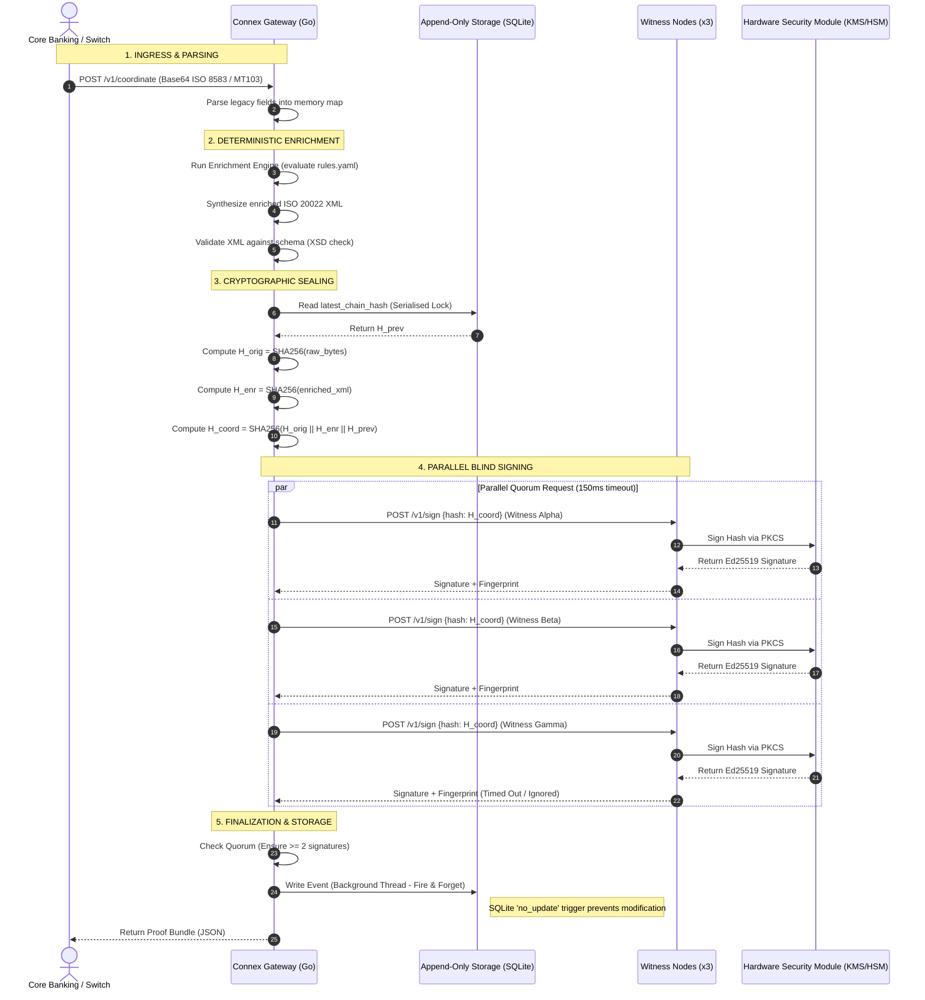

# The Vibe Coder's Handbook (Pro Version)

A strict, multi-agent engineering protocol and visual reference guide for pair programming with Antigravity to build high-quality, production-grade applications safely.

---

## 1. The Absolute Production Pipeline (APP)

The Pro Version protocol utilizes a strict multi-agent verification loop to translate user prompts into verified, zero-slop software. No code is committed to production directories until it passes isolation testing.



### The 4 Execution Phases:
1.  **Specification (AI Council - PM)**: The user prompt is ingested and parsed into functional specifications, schema designs, and strict binary "done when" checklists.
2.  **Implementation (AI Council - Engineer)**: Code is scaffolded inside an isolated sandbox directory (`scratch/`) alongside unit test harnesses.
3.  **Auditing & Gates (AI Council - Security & QA)**: The code is verified against 5 security non-negotiables, compiled, and run against test assertions.
4.  **Promotion (AI Council - Writer)**: Documentation is generated and the clean, passing files are promoted to the active project folders.

---

## 2. The AI Council Consensus Protocol

To ensure software quality, the main agent coordinates five specialized virtual subagents. Each agent enforces a separate concern during the development cycle.



### Council Member Responsibilities:

| Council Role | Key Focus Area | Active Verification Tools |
| :--- | :--- | :--- |
| **Product Manager (PM)** | User requirement mapping & functional specs | EARS specification models, done-when checklists |
| **Lead Engineer** | Safe, typed modular code implementation | Sandbox directories, strict compiler options, TDD scripts |
| **Security Officer** | Threat modeling & vulnerability scanning | Parameterized queries, CORS rule maps, Zod verification |
| **QA Lead** | Build compilation & regression testing | Playwright E2E runners, execution latency clocks |
| **Technical Writer** | Setup guides & API documentation | Walkthrough logs, relative file links, structural readmes |

---

## 3. Sandbox Verification Loop (TDD in Isolation)

To protect the production codebase from corruption or parsing failures:
1.  **Isolate**: Write prototype functions and test harnesses inside the `scratch/` directory (e.g., `scratch/test_feature.js`).
2.  **Execute**: Run the script using local process execution commands to capture stdout logs and exception stack traces.
3.  **Analyze**: Verify execution logs to confirm all happy and unhappy path assertions are met.
4.  **Promote**: Only copy the finalized code blocks to the active project directories once the sandbox test suite reports zero errors.



---

## 4. Anti-Slop Development Framework (ASDF)

Strict visual and code quality boundaries designed to maintain a premium, professional engineering standard:

### Visual Style Constraints:
*   **Typography**: Georgia headings, Calibri body text, Plus Jakarta Sans for data tables. Never use generic browser defaults.
*   **Colors**: Restricted to predefined HSL brand tokens (Navy `#0F1B2D`, Teal `#00869B`, Gold `#C09E5A`, Jungle Green `#004D40`). No gradient overlays.
*   **Layout Structure**: Zero glassmorphism (no backdrop-filter blur), zero animated count increments, zero skeleton loader animations, and zero canvas loops.
*   **Status Indicators**: Statuses are represented as uppercase, text-only badges: `VERIFIED`, `FAILED`, `PENDING`, `ERROR`. No colored dots or pulse waves.

### Code Quality Constraints:
*   **Strict Types**: Every query and transaction must map to a strong type. Never use `any` bindings in TypeScript.
*   **Zero Emojis**: Emojis are prohibited in commits, comments, consoles, or logs.
*   **Data Integrity**: Leverage database-level triggers (`BEFORE UPDATE`/`BEFORE DELETE`) to enforce append-only state rules at the storage level.

---

## 5. Case Study: Connex Reference MVP Architecture

Connex acts as the neutral, cryptographic coordination proof layer for inter-institutional payment handoffs in Kenya. The protocol enforces these exact design patterns to coordinate parallel witness signatures and ISO 20022 schema mapping.

### 5.1 Systems Architecture Data Flow
The sequence diagram illustrates how a legacy base64 transaction payload is ingested, deterministically transformed, sealed in a chain hash, signed via 2-of-3 witnesses, and written to append-only storage:



### 5.2 Zero-Trust Process Isolation Boundaries
The threat boundary design enforces **Zero-Trust process separation**. Public endpoints have zero direct database paths, and signing keys are isolated in secure hardware enclaves:

```mermaid
graph TB
    subgraph Public Internet [Public Internet - Untrusted Zone]
        Bank[Core Bank Switch]
    end

    subgraph DMZ [DMZ / Gateway VPC - Medium Trust Zone]
        GW[Connex Gateway Server]
        Rules[rules.yaml]
        XSD[ISO 20022 XSDs]
        
        GW --> Rules
        GW --> XSD
    end

    subgraph Internal [Internal Isolated VPC - High Trust Zone]
        DB[(Append-Only SQLite)]
        W_A[Witness Alpha]
        W_B[Witness Beta]
        W_C[Witness Gamma]
    end

    subgraph Secure Enclave [Secure Cryptographic Enclave - Zero Trust Zone]
        HSM_A[Physical HSM / AWS KMS]
        HSM_B[Physical HSM / AWS KMS]
        HSM_C[Physical HSM / AWS KMS]
    end

    %% Network Connections
    Bank -- "HTTPS POST Port 8080" --> GW
    GW -- "Append Event Background" --> DB
    
    %% Witness Connections
    GW -- "HTTPS Blind Sign Port 8091" --> W_A
    GW -- "HTTPS Blind Sign Port 8092" --> W_B
    GW -- "HTTPS Blind Sign Port 8093" --> W_C

    %% Cryptographic Connections
    W_A -- "PKCS#11 / TLS Private Link" --> HSM_A
    W_B -- "PKCS#11 / TLS Private Link" --> HSM_B
    W_C -- "PKCS#11 / TLS Private Link" --> HSM_C

    %% Styling
    style Bank fill:#16253B,stroke:#ff0000,stroke-width:2px;
    style GW fill:#16253B,stroke:#ff8000,stroke-width:2px;
    style W_A fill:#16253B,stroke:#00e500,stroke-width:2px;
    style W_B fill:#16253B,stroke:#00e500,stroke-width:2px;
    style W_C fill:#16253B,stroke:#00e500,stroke-width:2px;
    style HSM_A fill:#16253B,stroke:#00a3cc,stroke-width:3px;
    style HSM_B fill:#16253B,stroke:#00a3cc,stroke-width:3px;
    style HSM_C fill:#16253B,stroke:#00a3cc,stroke-width:3px;
```



### 5.3 Geo-Proximity Latency Routing Strategy
Witnesses are placed in independent global clouds to minimize latency for the East African banking switch while maintaining quorum resilience:

```mermaid
graph TD
    GW[Nairobi Gateway] -->|4ms RTT (Direct)| W_A(Witness Alpha - Cape Town)
    GW -->|56ms RTT (Regional)| W_B(Witness Beta - Johannesburg)
    GW -->|78ms RTT (Failover)| W_C(Witness Gamma - Europe-West)
```

### 5.4 Key Operations SLA & Performance Metrics

Active monitoring rules enforced in production switches:

| Operational Metric | Target SLA | Warning Threshold | Alert Threshold | Remediation Action |
| :--- | :--- | :--- | :--- | :--- |
| **Quorum Latency** | &lt; 100ms | &gt; 120ms | &gt; 145ms | Auto-triggered routing diagnostics. |
| **Quorum Success Rate**| 99.99% | &lt; 99.9% | &lt; 99.0% | Page on-call; trigger node health checks. |
| **DB Lock Contention** | &lt; 10ms | &gt; 25ms | &gt; 50ms | Trigger connection pool scaling. |
| **Witness Key Access** | 0 Unauthorized | 1 Audit Fail | &gt; 0 Unauth | **Automatic Lockout**: Isolate compromised node. |
| **Message Validation** | 100% Schema | N/A | Any Invalid | Reject payload; route to DLQ database. |

---

## 6. The Build Rhythm & Startup Ritual

### The 6-Step Loop:
```
   ┌─────────────────────────────────────────────────────────────┐
   │  1. SPEC      → Write what you want + "done when" criteria    │
   │  2. PLAN      → Let AI write implementation plan Artifact     │
   │  3. COMMIT    → Save Git checkpoint before code modification  │
   │  4. SLICE     → Build ONE micro-slice at a time               │
   │  5. CHECK     → Run sandbox validation & E2E tests            │
   │  6. COMMIT    → If passed: commit. If broken: revert & re-plan │
   │  ↺ Repeat from 4 for the next slice                         │
   └─────────────────────────────────────────────────────────────┘
```

### The Startup Ritual (First 30 Minutes of any Project):
1.  **Dedicated Workspace**: Spin up one project folder per AI thread. Never mix contexts.
2.  **Git Inception**: Initialize Git, create `.gitignore` (excluding `.env`), and make the initial commit.
3.  **Establish Constitution**: Drop [AGENTS.md](AGENTS.md) in the root.
4.  **Lock Tech Stack**: Formally declare your framework, language, and persistence configurations inside `AGENTS.md`.
5.  **Declare Goal**: Write a single-paragraph definition of what "works" means for this app.
6.  **Spec First Slice**: Author the first feature brief with explicit acceptance checklists *before* triggering code execution.

---

## 7. Reusable Prompt Templates Kit

### 7.1 Feature Specification Prompt
Use this template to brief the agent and trigger the plan-gate:
```text
FEATURE: [Short, one-line feature name]

WHAT IT DOES (Plain language, one paragraph):
[Describe what the user experiences, start to finish, and what the user value is]

DATA MODEL (What's stored and how it relates):
- [Entity Name], fields: [field_name: type, constraints, e.g., "email: text, required, unique"]
- [Entity Name] belongs to / has many [Entity Name]
- Relational database (PostgreSQL/Supabase)

WHO CAN DO WHAT (Roles & Permissions):
- Logged out user: can [...], cannot [...]
- [Role/User type]: can [...], cannot [...]
- Enforce ALL permission checks on the SERVER.

RULES THE SERVER MUST ENFORCE (Business logic, not UI styling):
- [e.g., "A booked slot is never offered to another user again"]
- [e.g., "Free plan limits block the 51st booking on the server-side API"]

INPUTS & ERRORS:
- Validate every input on the server: [Specify fields and validation rules]
- Handle edge cases: empty form submissions, duplicate submits, expired sessions. Do not fail silently.

INTEGRATIONS / SECRETS:
- Uses [Service/API name]. API key is a SERVER-SIDE secret managed in environment variables.

DONE WHEN (Acceptance Criteria — how this will be verified):
- [ ] [...]
- [ ] [Security-critical criterion]
- [ ] [Happy path test]
- [ ] [Unhappy path test]

CONSTRAINTS:
- Create an implementation plan as an Artifact first; wait for my approval before writing code.
- Touch only the files absolutely required for this feature.
- Do not refactor unrelated code.
- Follow the rules defined in AGENTS.md.
```

### 7.2 Security Audit Prompt
Use this template to verify proposed code artifacts:
```text
Review the proposed implementation against the 5 security non-negotiables:

1. **Permission Checks**: Are authorization and permission checks performed on the server (behind the API), rather than just hiding UI components in the browser?
2. **Secrets & Keys**: Are there any API keys, passwords, credentials, or private URLs written directly in the code (especially frontend client files) instead of environment variables?
3. **Input Validation**: Is every field in every user input validated and cleaned on the server before database write or processing?
4. **Rate Limiting**: Are public or unauthenticated endpoints rate-limited to prevent abuse or bot spam?
5. **Data Isolation**: Does every database query verify record ownership, ensuring one user cannot fetch or modify another user's records simply by changing an ID parameter?

For each rule:
- Answer YES or NO.
- State exactly where in the codebase this rule is enforced (file and line numbers).
- Highlight any concerns or remediation steps if a rule is not fully satisfied.
```

### 7.3 Debugging Diagnosis Prompt
Use this template to handle exceptions systematically:
```text
Here is an issue that needs debugging:

EXACT ERROR MESSAGE / LOG:
[Paste the raw error message, stack trace, browser console log, or server log here]

REPRODUCTION STEPS:
[List the exact steps, inputs, or navigation actions that trigger this error]

INSTRUCTIONS:
1. Do not modify or edit any files yet.
2. Explain the root cause of this error in plain English.
3. Show exactly where the error occurs (files and line numbers).
4. Propose a specific fix and list all files that will be touched by it.
5. Wait for my approval before making any code modifications.
```
