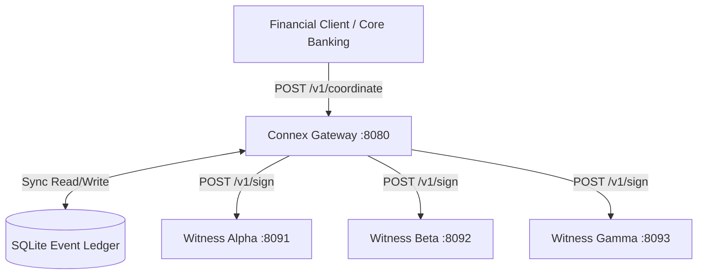
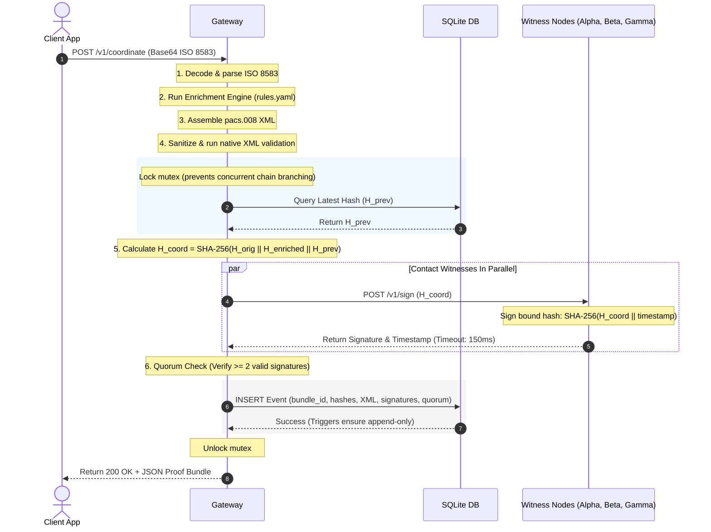

---

# Connex System Architecture & Quorum Mechanics

Welcome to the Connex Core System Architecture guide. This document is written specifically for developers who are new to the Go programming language or new to financial coordination ledgers. By the end of this guide, you will understand how the system is laid out, how data flows through it, and how to replicate its core design from scratch.

---

## 1. High-Level System Topography

The Connex system is a decentralized, high-throughput financial message coordinator. Its job is to take legacy financial transaction messages (specifically ISO 8583 format), validate and enrich them into modern XML standards (ISO 20022 format), obtain cryptographic consensus from multiple independent witness nodes, and record the transaction in an append-only hash-chained database.

The system consists of three main components:

1.  **The Gateway (`cmd/gateway/`)**:
    - The central router and pipeline coordinator.
    - Exposes an HTTP API for incoming transactions.
    - Runs the parsing, enrichment, XML generation, consensus collection, and database commit.
    - Manages the cryptographic state of the transaction ledger.
2.  **The Witness Nodes (`cmd/witness/`)**:
    - Independent cryptographic signers.
    - They do not share state, databases, or communication lines with each other.
    - They hold individual private key pairs (`Ed25519`).
    - Their only task is to check authorization and sign incoming transaction coordination hashes.
3.  **The SQLite Storage Layer (`internal/storage/`)**:
    - An append-only relational ledger.
    - Secured by database-level triggers to guarantee that data cannot be modified or deleted.



---

## 2. End-to-End Request-Response Flow

When a transaction arrives, it progresses through a strict, sequential pipeline. This pipeline is fully synchronous to ensure that if any step fails (such as database write failure or lack of signature quorum), the caller is notified immediately with an error, and the transaction is not committed.

Here is the exact lifecycle of a coordination request:



---

## 3. The 2-of-3 Quorum Mechanics (Deep Dive)

### What is a Quorum?
In distributed systems, a **quorum** is the minimum number of votes or nodes that must authorize an action to make it legally valid. 

For Connex:
- We deploy **3 independent witnesses** (Alpha, Beta, Gamma).
- We require **at least 2 witnesses** to successfully sign the coordination hash.
- This configuration is resilient to a single node outage: if one witness is down or unreachable, the system can still process transactions continuously. If two or more are offline, the transaction is marked as `QUORUM_FAILED`.

### Implementing Concurrent Fan-out in Go
To get signatures from 3 different network addresses without making the user wait for each request sequentially, we use Go's native concurrency primitives: **Goroutines**, **Channels**, and the **Select Statement**.

#### The Go Primitives Explained for Beginners:
1.  **Goroutines (`go func()`)**: Light-weight threads managed by the Go runtime. They run concurrently with the rest of the program.
2.  **Channels (`chan`)**: Safe communication pipes used to send data between goroutines without explicit locking. We use a *buffered channel* (`make(chan result, 3)`) so that sending a result does not block the witness goroutine, even if the main thread is busy.
3.  **Select Statement (`select`)**: A control structure unique to Go that lets a goroutine wait on multiple channel operations. Whichever channel receives data first is executed. We combine it with `time.After` to enforce a hard deadline (timeout).

Here is the annotated code snippet from `cmd/gateway/main.go` that implements this:

```go
type result struct {
    sig *SignatureEntry
    err error
}

func collectSignatures(witnesses []string, tokens []string, hashBytes []byte, timeout time.Duration) []SignatureEntry {
    // 1. Create a buffered channel to hold up to 3 results.
    // Buffering prevents goroutine leaks; witness routines can exit immediately 
    // after sending their result, even if the parent function times out.
    ch := make(chan result, len(witnesses))

    // 2. Spawn a concurrent goroutine for each witness.
    for i, w := range witnesses {
        w := w
        var token string
        if i < len(tokens) {
            token = tokens[i]
        }
        go func() {
            // This function runs in the background.
            sig, err := requestSignature(w, token, hashBytes, timeout)
            ch <- result{sig, err} // Send result into the channel
        }()
    }

    var sigs []SignatureEntry
    
    // 3. Create a timer channel that sends a signal after the timeout (150ms).
    deadline := time.After(timeout)

    // 4. Collect results.
    for range witnesses {
        select {
        case r := <-ch:
            // A witness responded (either successfully or with a connection error)
            if r.err != nil {
                slog.Warn("witness error", "err", r.err)
            } else {
                sigs = append(sigs, *r.sig)
            }
        case <-deadline:
            // The deadline was reached before all witnesses responded.
            // Return whatever signatures we managed to collect so far.
            slog.Warn("witness timeout reached", "collected", len(sigs))
            return sigs
        }
    }
    return sigs
}
```

---

## 4. Replicating this Design (Beginner Tips)

If you are looking to build a similar system or replicate this, pay close attention to:
- **Goroutine Leaks**: Always use buffered channels when launching goroutines that write to a channel and might be abandoned due to a timeout. If the channel is unbuffered, the background goroutine will block forever trying to write to the channel, slowly consuming memory.
- **Mutex Locks**: When working with shared state in memory (like checking the latest chain hash to form the next transaction hash), you must serialize updates. In `gateway/main.go`, this is achieved by locking a `sync.Mutex` during the hash query and insert sequence:
  ```go
  g.mu.Lock()
  defer g.mu.Unlock() // runs automatically when handleCoordinate exits
  ```
