<picture>
  <source media="(prefers-color-scheme: dark)" srcset="connex_logo_dark.png">
  <source media="(prefers-color-scheme: light)" srcset="connex_logo_light.png">
  
</picture>

---

# Go Programming: Learn by Reading CONNEX
### A Beginner's Course Built From the Real Banking System

---

## How This Course Was Built — The Science of Learning

Every section uses techniques proven by cognitive science to make learning stick:

```
┌─────────────────────────────────────────────────────────────────────────┐
│                    8 TECHNIQUES IN THIS COURSE                          │
├───────────────────────┬─────────────────────────────────────────────────┤
│  Active Recall        │  Write it yourself before seeing the answer     │
│  Spaced Repetition    │  Review checkpoints bring old topics back       │
│  Interleaving         │  Later quizzes mix multiple chapters together   │
│  Feynman Technique    │  "Teach It Back" prompt after every chapter     │
│  Elaborative Inquiry  │  "Ask Why?" section after every real code block │
│  Concrete Examples    │  Analogy before definition, every time          │
│  Chunking             │  One concept per chapter, never more            │
│  Immediate Practice   │  Quiz appears right after the lesson            │
└───────────────────────┴─────────────────────────────────────────────────┘
```

> ⚠️ **Safety Rule:** Create a folder called `sandbox/` on your Desktop. ALL practice goes there. Never edit `cmd/` or `internal/`. You cannot break the bank from your sandbox.

---

## The Big Picture — What You Are Learning To Read

Before you write a single line, understand what CONNEX actually is:

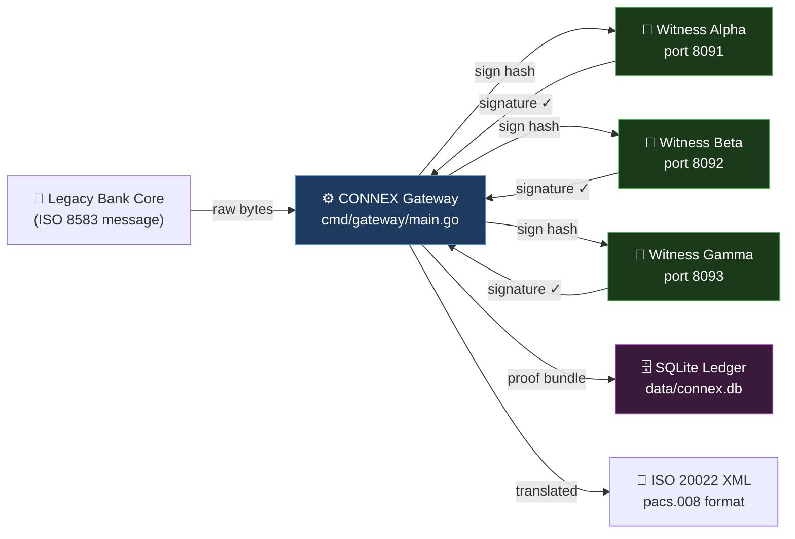

**This course teaches you Go by reading every file shown above, line by line.**

---

## Your Study Roadmap


---

---

# Chapter 1: Packages and Imports

---

## 📖 The Analogy

```
Before cooking, a chef does two things:

  1. Declares the kitchen:  "This is the MAIN kitchen — not a prep room."
  2. Gathers tools:         knife, pot, measuring cup, timer

In Go:

  package main   =   "This is the main kitchen — a runnable program."
  import (...)   =   "These are the tools I need from the supply room."
```

---

## How Imports Work — Visual

```
  The Go Standard Library (built-in toolboxes)
  ┌────────────────────────────────────────────────────────────┐
  │                                                            │
  │  crypto/          encoding/       net/         os          │
  │  ├── ed25519      ├── base64      └── http     log/slog   │
  │  ├── rand         ├── hex                      flag        │
  │  └── sha256       └── json        time         fmt         │
  │                                   path/filepath            │
  └────────────────────────────────────────────────────────────┘
              │                │                │
              ▼                ▼                ▼
       cmd/witness/main.go imports only what it needs:
       "crypto/ed25519", "fmt", "net/http", "time", ...
```

---

## 🔍 Real Code — `cmd/witness/main.go` Lines 11–27

```go
package main

import (
    "crypto/ed25519"   // 🔑 Ed25519 cryptographic signatures
    "crypto/rand"      // 🎲 Secure random number generator
    "crypto/sha256"    // 🔒 SHA-256 hashing
    "encoding/base64"  // 📝 Binary bytes → readable Base64 text
    "encoding/hex"     // 🖊️  Binary bytes → hex string like "3f8a1c"
    "encoding/json"    // 📋 Read and write JSON
    "flag"             // 🚩 Read command-line arguments
    "fmt"              // 🖨️  Format and print text
    "log/slog"         // 📓 Structured log messages (key=value pairs)
    "net/http"         // 🌐 Build web servers, make HTTP requests
    "os"               // 💾 Read/write files, talk to the OS
    "path/filepath"    // 📁 Work with file paths safely on any OS
    "time"             // ⏰ Dates, clocks, timers, durations
)
```

**Why import so many?** The Witness Node does many jobs at once:

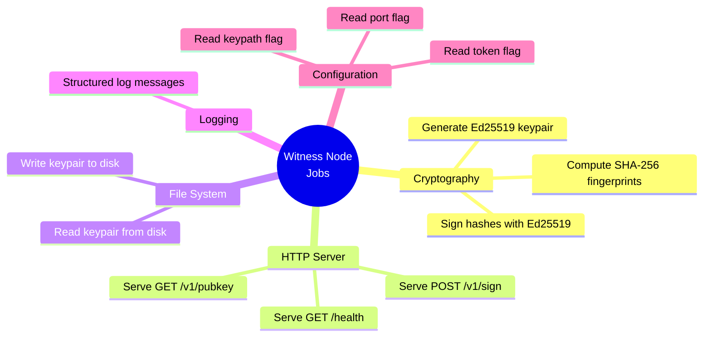

Each job needs its own toolbox.

---

## ❓ Ask Why?

- **Why** does Go refuse to compile if you import a toolbox and never use it?
- **Why** does `"crypto/sha256"` use a `/` and not a dot like other languages?

*(Answer #1: Unused imports are a sign of lazy or copy-pasted code. In banking software, every dependency is a potential security risk. Go forces you to be intentional.)*

---

## 🧠 Feynman Check

Close this. Write in a notepad: *"What does `package main` mean, and why do we write `import`?"* — in your own words, as if explaining to a 10-year-old.

---

## ✏️ Quiz 1

Create `sandbox/quiz1.go`. Write a program that:
1. Declares `package main`
2. Imports only `fmt` and `time`
3. Prints: `"CONNEX Witness — Online"`
4. Prints the current time

Run with: `go run quiz1.go`

---

## ✅ Answer — Quiz 1

```go
package main

import (
    "fmt"
    "time"
)

func main() {
    fmt.Println("CONNEX Witness — Online")
    fmt.Println("Current time:", time.Now())
}
```

**Expected output:**
```
CONNEX Witness — Online
Current time: 2026-05-27 18:51:00.123456789 +0300 EAT
```

**Common mistake:** Writing two separate `import "fmt"` and `import "time"` lines. Always use the parenthesis block for multiple imports.

---

---

# Chapter 2: Variables, Pointers, Slices, Maps & Encoding

---

## 📖 The Analogy

Imagine your computer's RAM is a massive grid of safety deposit boxes. Each box has a unique number stamped on it (its **Memory Address**).

```
   Memory Box #1024       Memory Box #1025       Memory Box #1026
  ┌──────────────────┐   ┌──────────────────┐   ┌──────────────────┐
  │      "Equity"    │   │       1247       │   │     98750.50     │
  │      (string)    │   │      (int)       │   │    (float64)     │
  └──────────────────┘   └──────────────────┘   └──────────────────┘
```

When you write `bankName := "Equity"`, Go goes to the grid, finds an empty box (say box `#1024`), labels it `bankName`, and slips the text `"Equity"` inside.

---

## Data Types — The Complete Reference

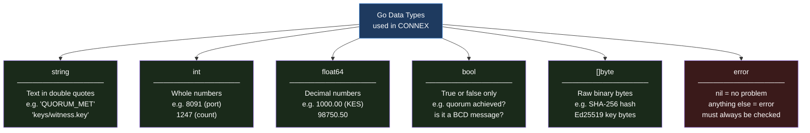

---

## Pointers: What Are They and Why Do We Care?

A **Pointer** is a variable that stores the **address** of another variable. Instead of holding a value like `"Equity"` or `1247`, it holds the box number.

- **`&` (Address-of Operator):** Reads the label on the box to get its address. Think of it as "Where is this variable?"
- **`*` (Dereference Operator):** Goes to that address and reads or changes what is inside the box. Think of it as "Open the box at this address."

```
   ┌────────────────────────────────┐
   │ pointerToCount := &count       │  --> holds #1025
   └───────────────┬────────────────┘
                   │
                   ▼ (dereferencing with *pointerToCount)
   ┌────────────────────────────────┐
   │ Box #1025: count = 1247        │
   └────────────────────────────────┘
```

Why do we need pointers in banking?
If you pass a massive struct (like a full transaction bundle) to a function, Go's default behavior is to **copy** the entire thing. Copying takes memory and time. Instead, we pass a pointer (the memory address) to the struct. The function can read or edit the original transaction directly, without copying it!

---

## Slices vs. Arrays: Managing Lists of Data

In banking, you deal with lists of things: lists of signatures, lists of transaction logs, list of bytes.

1. **Array:** A fixed-length row of boxes. Once created, you cannot change its size.
   `var hash [32]byte` -> exactly 32 bytes.
2. **Slice:** A dynamic, resizable window looking at an underlying array.
   `var signatures []SignatureEntry` -> can grow or shrink.

### Under the Hood of a Slice
A slice is actually a small struct containing three things:
1. **Pointer:** The address where the list starts in memory.
2. **Length (`len`):** How many items are currently in the slice.
3. **Capacity (`cap`):** How many items the slice *can* hold before Go must allocate a new, larger backing array.

```
                  Slice Header: [ Pointer: #2000, Length: 2, Capacity: 4 ]
                                        │
                                        ▼
Backing Array:  [ "Alpha", "Beta", (empty), (empty) ]
                 #2000    #2008    #2016    #2024
```

When you call `append(slice, "Gamma")`, Go adds `"Gamma"` to the next empty spot. If the capacity is full, Go automatically:
1. Creates a new, double-sized backing array somewhere else in memory.
2. Copies the old items to the new array.
3. Adds the new item.
4. Updates the slice pointer to point to the new array.

---

## Maps: Key-Value Storage

A map is like a physical index card box. You search for a card by a **Key** (like field number `4` in ISO 8583) and retrieve the **Value** (like the amount `"000000100000"`).

In Go, maps are declared as: `map[KeyType]ValueType`.
Example: `Fields map[int]string` -> keys are integers, values are strings.

### The "Comma OK" Idiom
What happens if you search for a key that isn't in the map? Go returns the "zero value" (like `""` for string or `0` for int). In banking, you must know if a field is genuinely blank or if it simply wasn't sent. We check this using the "comma ok" syntax:

```go
value, ok := myMap[key]
```
- If `ok` is `true`, the key exists in the map, and `value` holds the value.
- If `ok` is `false`, the key does not exist in the map.

---

## ASCII vs. BCD: How Banks Save Bandwidth

Legacy mainframes and ATMs communicate using the **ISO 8583** standard. To save network bandwidth, they encode numbers using **BCD (Binary Coded Decimal)**.

Let's compare how the number `1234` is sent across the wire:

```
ASCII Encoding (1 byte per character):
Character:       '1'          '2'          '3'          '4'
Binary:       00110001     00110010     00110011     00110100
Hex Value:      0x31         0x32         0x33         0x34      --> Total: 4 bytes

BCD Encoding (4 bits per digit, packed 2 digits per byte):
Digits:         1    2         3    4
Binary:        0001 0010      0011 0100
Hex Value:       0x12           0x34                         --> Total: 2 bytes (50% savings!)
```

### Bit Shifting to Decode BCD
To decode a single byte containing two BCD digits (like `0x12`):
1. **High Nibble (first digit `1`):** Shift the byte 4 bits to the right.
   `0x12` is `00010010`. Shift right by 4: `00000001` (which is `1`).
   In Go: `digit1 := b >> 4`
2. **Low Nibble (second digit `2`):** Mask out the high bits using a bitwise AND operator `&` with `0x0F` (`00001111`).
   `00010010 & 00001111` = `00000010` (which is `2`).
   In Go: `digit2 := b & 0x0F`

---

## 🔍 Real Code — `cmd/witness/main.go` Lines 34–35

```go
privPath := keyPath          // Box "privPath" gets a copy of keyPath's value
pubPath  := keyPath + ".pub" // Box "pubPath" gets keyPath + ".pub" glued on
```

**The `:=` operator does TWO things at once:**

```
  privPath  :=  keyPath
  ────────  ──  ───────
  Create     Do  Copy the
  a new box  it  value in
  named      at  here
  privPath   the
             same
             time
```

If `keyPath = "keys/witness.key"`:
```
  Before:          After:
  ┌──────────┐     ┌──────────────────┐  ┌────────────────────────┐
  │ keyPath  │     │    privPath      │  │       pubPath          │
  │          │ ──► │                  │  │                        │
  │"keys/    │     │"keys/witness.key"│  │"keys/witness.key.pub"  │
  │witness   │     └──────────────────┘  └────────────────────────┘
  │.key"     │
  └──────────┘
```

---

## 🔍 Real Code — Bundle ID Creation — `cmd/gateway/main.go` Line 198

```go
bundleID := fmt.Sprintf("CX-%s-%x", time.Now().UTC().Format("20060102150405.000000"), randBytes)
```

**Unwrapped piece by piece:**

```
"CX - %s - %x"
  │    │    └── %x = these bytes printed as hex: "3f8a1c2b"
  │    └─────── %s = this string goes here
  └──────────── fixed prefix for all CONNEX bundles

time.Now().UTC()                      = the current moment in UTC
  .Format("20060102150405.000000")    = "20260522154100.000000"
                                         ────┬────────────────
                                       YYYYMMDDHHMMSS.microseconds

randBytes                             = 4 random bytes → "3f8a1c2b" in hex

Result: "CX-20260522154100.000000-3f8a1c2b"
```

Every transaction in history gets a unique ID because time + randomness = uniqueness.

---

## 🔍 Real Code - BCD Decoding in `internal/iso8583/parser.go`

Let's read the real code that translates BCD bytes back into readable text strings:

```go
func decodeBCD(bytes []byte, digits int) string {
    var sb strings.Builder
    for _, b := range bytes {
        sb.WriteString(fmt.Sprintf("%02x", b))
    }
    val := sb.String()
    if len(val) > digits {
        val = val[:digits]
    }
    return val
}
```

---

## ❓ Ask Why?

- **Why** does CONNEX store money as `float64` and not just `int`?
- **Why** does Go's time format use `"20060102"` instead of `"YYYYMMDD"` like other languages?
- **Why** does BCD decoding use `%02x` instead of normal print formats?

*(Answers: 
1. CONNEX gateway converts the cents into standard currency units for the ISO 20022 XML translation. In real bank ledgers, however, integers are always preferred to avoid floating-point rounding errors.
2. Go's time package uses a specific reference moment — January 2, 2006, 15:04:05 — as its template. The numbers 1,2,3,4,5,6 represent month,day,hour,minute,second,year in order. This is quirky but memorable once you know it.
3. Since each half of a BCD byte is a number from 0-9, printing the byte in hexadecimal format (base-16) naturally separates the two nibbles! For example, `0x12` printed as hex gives exactly `"12"`. It's a clever, high-performance shortcut to decode BCD digits!)*

---

## ✏️ Quiz 2A: Variable & Pointer Manipulation

Create `sandbox/quiz2a.go`. Write a program that:
1. Declares a variable `balance` as a float64 with a value of `50000.75`.
2. Declares a pointer `p` that points to `balance`.
3. Prints the memory address stored in `p` and the value stored at that address.
4. Modifies the balance to `65000.20` using the pointer `p`.
5. Prints the new value of `balance` directly.

---

## ✅ Answer — Quiz 2A

```go
package main

import "fmt"

func main() {
    balance := 50000.75
    p := &balance // p holds the memory address of balance

    fmt.Printf("Memory address: %p\n", p)
    fmt.Printf("Value at address: %.2f\n", *p)

    *p = 65000.20 // change the value inside balance's box

    fmt.Printf("Updated balance: %.2f\n", balance)
}
```

**Expected Output:**
```
Memory address: 0xc0000120b8 (will vary per run)
Value at address: 50000.75
Updated balance: 65000.20
```

---

## ✏️ Quiz 2B: Slices & Capacity

Create `sandbox/quiz2b.go`. Write a program that:
1. Declares a slice of strings `witnesses` containing `"alpha"` and `"beta"`.
2. Prints its current length and capacity.
3. Appends `"gamma"` to the slice.
4. Prints the new length and capacity.
5. Appends `"delta"` and `"epsilon"`.
6. Prints the final length, capacity, and contents.

---

## ✅ Answer — Quiz 2B

```go
package main

import "fmt"

func main() {
    witnesses := []string{"alpha", "beta"}
    fmt.Printf("Start: len=%d, cap=%d, contents=%v\n", len(witnesses), cap(witnesses), witnesses)

    witnesses = append(witnesses, "gamma")
    fmt.Printf("After 1 append: len=%d, cap=%d, contents=%v\n", len(witnesses), cap(witnesses), witnesses)

    witnesses = append(witnesses, "delta", "epsilon")
    fmt.Printf("After 3 appends: len=%d, cap=%d, contents=%v\n", len(witnesses), cap(witnesses), witnesses)
}
```

**Expected Output:**
```
Start: len=2, cap=2, contents=[alpha beta]
After 1 append: len=3, cap=4, contents=[alpha beta gamma]
After 3 appends: len=5, cap=8, contents=[alpha beta gamma delta epsilon]
```

**Beginner Pitfall:** Notice that the capacity doubled from 2 to 4 when we appended `"gamma"`, and then from 4 to 8 when we appended `"delta"` and `"epsilon"`. Go allocated a new array and copied the data automatically under the hood to accommodate the growth.

---

## ✏️ Quiz 2C: Maps & "Comma OK" check

Create `sandbox/quiz2c.go`. Write a program that:
1. Creates a map named `isoFields` mapping integer keys to string values.
2. Inserts key `3` with value `"310100"` (Processing Code) and key `4` with value `"000000500000"` (Amount).
3. Looks up key `4` using the "comma ok" idiom and prints whether it was found.
4. Looks up key `11` (STAN) using the "comma ok" idiom and prints whether it was found.

---

## ✅ Answer — Quiz 2C

```go
package main

import "fmt"

func main() {
    isoFields := make(map[int]string)
    isoFields[3] = "310100"
    isoFields[4] = "000000500000"

    val4, ok4 := isoFields[4]
    if ok4 {
        fmt.Printf("Field 4 found: %s\n", val4)
    } else {
        fmt.Println("Field 4 not found!")
    }

    val11, ok11 := isoFields[11]
    if ok11 {
        fmt.Printf("Field 11 found: %s\n", val11)
    } else {
        fmt.Println("Field 11 not found (returned empty zero-value: \"" + val11 + "\")")
    }
}
```

**Expected Output:**
```
Field 4 found: 000000500000
Field 11 not found (returned empty zero-value: "")
```

---

## 🔄 Review Checkpoint 1

Answer from memory — no peeking:

1. What does `package main` tell Go?
2. What does `:=` do that `=` cannot?
3. What is a pointer and how do `&` and `*` work?
4. What is the difference between length and capacity in a slice?
5. How does the "comma ok" syntax check if a map contains a key?
6. Explain why packed BCD uses half the bytes of ASCII to store numbers.

---

---

# Chapter 3: Structs — Grouping Related Data

---

## 📖 The Analogy

A single bank transaction has many pieces of data. Storing them in separate variables would be messy. A **struct** is a custom form — you define its fields once, then fill it out for each transaction.

```
  CONNEX PROOF BUNDLE FORM
  ══════════════════════════════════════════════════════
  Bundle ID     │  CX-20260522154100.000000-3f8a1c2b
  ──────────────┼───────────────────────────────────────
  Timestamp     │  2026-05-22T15:41:00.123456Z
  ──────────────┼───────────────────────────────────────
  Original Hash │  d503ffab67cf2bdb4a8a1f4c33827a2...
  ──────────────┼───────────────────────────────────────
  Enriched Hash │  94c2367ab6be1b8b2e3a4f5c6d7e8f9...
  ──────────────┼───────────────────────────────────────
  Quorum Status │  QUORUM_MET
  ──────────────┼───────────────────────────────────────
  Signatures    │  [ Alpha ✓, Beta ✓ ]
  ══════════════════════════════════════════════════════

  In Go, this form is called the "Bundle" struct.
```

---

## How Structs Relate to Each Other

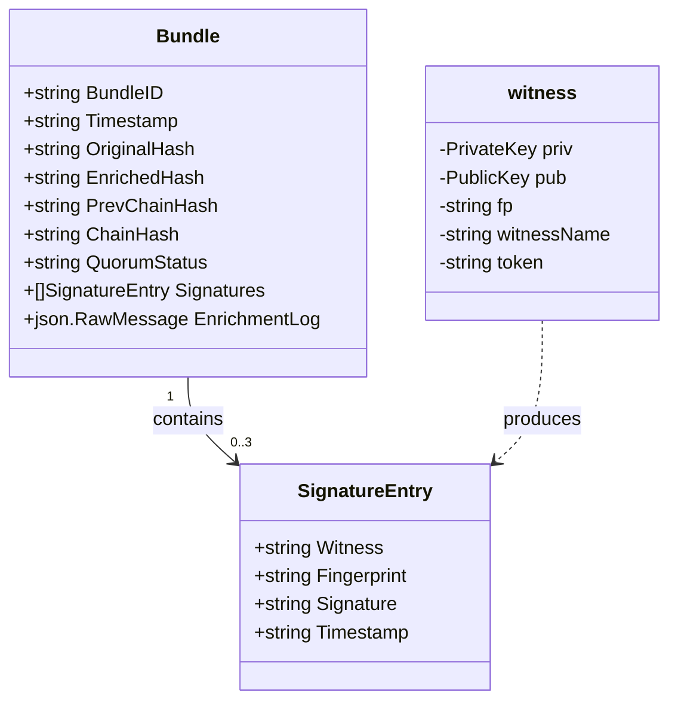

---

## 🔍 Real Code — `cmd/gateway/main.go` Lines 34–51

```go
// SignatureEntry — one witness's cryptographic signature
type SignatureEntry struct {
    Witness     string `json:"witness"`      // "alpha", "beta", or "gamma"
    Fingerprint string `json:"fingerprint"`  // SHA-256 fingerprint of the public key
    Signature   string `json:"signature"`    // The actual Ed25519 signature (base64)
    Timestamp   string `json:"timestamp"`    // When the witness signed
}

// Bundle — the complete proof record for one bank transaction
type Bundle struct {
    BundleID      string          `json:"bundle_id"`
    Timestamp     string          `json:"timestamp"`
    OriginalHash  string          `json:"original_hash"`
    EnrichedHash  string          `json:"enriched_hash"`
    PrevChainHash string          `json:"prev_chain_hash"`
    ChainHash     string          `json:"chain_hash"`
    Signatures    []SignatureEntry `json:"signatures"`    // A LIST of signatures
    QuorumStatus  string          `json:"quorum_status"`
    EnrichmentLog json.RawMessage `json:"enrichment_log"`
}
```

**Anatomy of one field — broken apart:**

```
    BundleID          string          `json:"bundle_id"`
    ────────          ──────          ──────────────────
       │                │                     │
    Field name       Data type           Struct tag:
    (Go code uses    (this field          When json.Marshal
    this name)       holds text)          writes this to JSON,
                                          call it "bundle_id"
                                          not "BundleID"
```

---

## Struct Instantiation: Value vs. Pointer

There are two primary ways to create (instantiate) a struct:

### 1. As a Value (Stored directly on the stack)
```go
entry := SignatureEntry{
    Witness: "alpha",
    Signature: "a1b2c3...",
}
```
This allocates the struct data directly in the local execution scope. If you pass `entry` to another function, Go copies the entire struct.

### 2. As a Pointer (Allocated on the heap)
```go
entryPtr := &SignatureEntry{
    Witness: "alpha",
    Signature: "a1b2c3...",
}
```
The `&` operator allocates the struct in memory and returns its **memory address** (a pointer). Passing `entryPtr` to a function only copies the memory address (8 bytes), which is extremely efficient and allows the function to modify the original struct fields directly.

---

## ✏️ Quiz 3A: Struct Pointers and Modification

Create `sandbox/quiz3a.go`. Write a program that:
1. Defines a struct `WitnessState` with fields: `Name` (string) and `Active` (bool).
2. Write a function `deactivate(w *WitnessState)` that changes `Active` to `false` using the pointer.
3. In `main()`, instantiate a pointer to `WitnessState` with `Name: "Beta"` and `Active: true`.
4. Print the state, call `deactivate`, and print the state again to verify it has changed.

---

## ✅ Answer — Quiz 3A

```go
package main

import "fmt"

type WitnessState struct {
    Name   string
    Active bool
}

func deactivate(w *WitnessState) {
    w.Active = false // Modifies the original struct since 'w' is a pointer
}

func main() {
    // Instantiate as a pointer using the & operator
    witness := &WitnessState{
        Name:   "Beta",
        Active: true,
    }

    fmt.Printf("Before: Name=%s, Active=%t\n", witness.Name, witness.Active)

    deactivate(witness)

    fmt.Printf("After:  Name=%s, Active=%t\n", witness.Name, witness.Active)
}
```

**Expected Output:**
```
Before: Name=Beta, Active=true
After:  Name=Beta, Active=false
```

---

## ✏️ Quiz 3B: JSON Serialization & Deserialization

Create `sandbox/quiz3b.go`. Write a program that:
1. Defines a struct `SystemConfig` with public fields `Port` (int) and `DBPath` (string), mapped to JSON tags `"port"` and `"db_path"`.
2. Adds a private field `secretToken` (string).
3. In `main()`, instantiate `SystemConfig` with a port of `8080`, database path `"data/connex.db"`, and token `"SUPER_SECRET"`.
4. Serializes the struct to JSON using `json.Marshal` and prints the JSON string.
5. In the printed JSON, observe whether the private field `secretToken` is present or missing.
6. Write a JSON string `{"port":9000,"db_path":"/tmp/test.db"}` and deserialize it back into a new `SystemConfig` struct using `json.Unmarshal`. Print the struct fields.

---

## ✅ Answer — Quiz 3B

```go
package main

import (
    "encoding/json"
    "fmt"
)

type SystemConfig struct {
    Port        int    `json:"port"`
    DBPath      string `json:"db_path"`
    secretToken string // private field
}

func main() {
    config := SystemConfig{
        Port:        8080,
        DBPath:      "data/connex.db",
        secretToken: "SUPER_SECRET",
    }

    // 1. Serialize to JSON
    jsonBytes, err := json.Marshal(config)
    if err != nil {
        fmt.Println("Error marshalling:", err)
        return
    }
    fmt.Println("JSON output:", string(jsonBytes))

    // 2. Deserialize from JSON string
    inputJSON := `{"port":9000,"db_path":"/tmp/test.db"}`
    var newConfig SystemConfig

    // We MUST pass a pointer to newConfig so Unmarshal can modify its fields!
    err = json.Unmarshal([]byte(inputJSON), &newConfig)
    if err != nil {
        fmt.Println("Error unmarshalling:", err)
        return
    }

    fmt.Printf("Deserialized struct: Port=%d, DBPath=%s, secretToken=%q\n",
        newConfig.Port, newConfig.DBPath, newConfig.secretToken)
}
```

**Expected Output:**
```
JSON output: {"port":8080,"db_path":"data/connex.db"}
Deserialized struct: Port=9000, DBPath=/tmp/test.db, secretToken=""
```

**Common Mistakes & Pitfalls:**
- The private field `secretToken` is completely ignored in the JSON output, and when deserializing, it stays as its default empty string value `""`. This is because the `json` package runs outside our main package and cannot access private fields.
- Forgetting to pass the address (`&newConfig`) to `json.Unmarshal`. If you pass it by value, Go passes a copy, and your original struct is never updated.

---

## 🔄 Review Checkpoint 2

Answer from memory:

1. What is the difference between instantiating a struct as `MyStruct{}` vs `&MyStruct{}`?
2. What are struct tags used for, and how does the `json` package read them?
3. Why is it important to capitalize fields in Go structs that will be serialized to JSON?
4. What happens when you try to access a lowercase field of a struct imported from another package?
5. Write the correct way to call `json.Unmarshal` to fill a struct variable `config`.


---

# Chapter 4: Functions & Scope — Reusable Recipes

---

## 📖 The Analogy

```
  WITHOUT functions:                WITH functions:
  ──────────────────                ────────────────
  hash TX-001:                      func sha256Hex(data) {
    h = sha256(TX-001)                  h = sha256(data)
    return hex(h)                       return hex(h)
                                    }
  hash TX-002:
    h = sha256(TX-002)              sha256Hex(TX-001)  ← one line
    return hex(h)                   sha256Hex(TX-002)  ← one line
                                    sha256Hex(TX-003)  ← one line
  hash TX-003:
    h = sha256(TX-003)              Write once. Call everywhere.
    return hex(h)

  ❌ Repeated 10,000 times          ✅ Written once, used 10,000 times
```

---

## Function Anatomy — Visual

```
  func  sha256Hex  (data []byte)  (string, error)  {
  ────  ─────────  ────────────   ───────────────
   │       │            │                │
   │    Name of      Parameter:       Return
   │    the recipe   ingredient       types:
   │                 named "data"     gives back a
  keyword            of type          string AND
  that starts        []byte           an error
  a recipe
```

---

## Pass-by-Value vs. Pass-by-Pointer

In Go, **everything is passed by value**. This means that when you pass a variable into a function, Go makes a **copy** of that variable and hands the copy to the function.

### 1. Pass-by-Value (Copying the value)
```go
func updateAmount(amount float64) {
    amount = 5000.00
}
```
If you pass `balance` into `updateAmount`, the function gets a copy of `balance`. Changing `amount` inside the function does NOT change the original `balance` outside the function!

### 2. Pass-by-Pointer (Copying the address)
```go
func updateAmountPtr(amount *float64) {
    *amount = 5000.00
}
```
If you pass `&balance` (the memory address) into `updateAmountPtr`, the function gets a copy of the *address*. By using `*amount` (dereferencing), the function opens the original box at that address and changes the original `balance`!

---

## Understanding Variables Scope

Where a variable lives determines who can see it. Go has strict scoping rules:

```
  ┌────────────────────────────────────────────────────────┐
  │ Package Scope (Declared outside functions)             │
  │ Visible to any code in this directory/package          │
  │ e.g., var de = map[int]fieldDef{...}                   │
  │                                                        │
  │   ┌────────────────────────────────────────────────┐   │
  │   │ Local/Function Scope (Declared inside func)   │   │
  │   │ Visible ONLY inside this function              │   │
  │   │ e.g., bundleID := "CX-..."                     │   │
  │   │                                                │   │
  │   │   ┌────────────────────────────────────────┐   │   │
  │   │   │ Block Scope (Declared inside if/for)   │   │   │
  │   │   │ Visible ONLY inside this block         │   │   │
  │   │   │ e.g., if err != nil { msg := "fail" }  │   │   │
  │   │   └────────────────────────────────────────┘   │   │
  │   └────────────────────────────────────────────────┘   │
  └────────────────────────────────────────────────────────┘
```

---

## How Functions Call Each Other in CONNEX

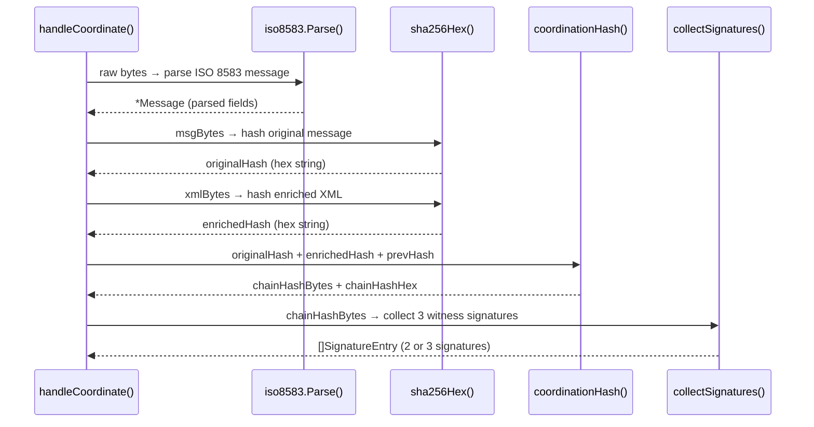

Every arrow in that diagram is a function calling another function. `sha256Hex` is called **twice** for every single transaction.

---

## 🔍 Real Code — `cmd/gateway/main.go` Lines 125–128

```go
func sha256Hex(data []byte) string {
    h := sha256.Sum256(data)        // Compute the hash. h is of type [32]byte
    return hex.EncodeToString(h[:]) // h[:] converts [32]byte to []byte, then hex encode
}
```

**What happens inside, step by step:**

```
  Input:  "Alice sends 1000 KES to Bob"  (as []byte)
      │
      ▼
  sha256.Sum256(data)
      │
      ▼
  h = [32]byte{0xd5, 0x03, 0xff, 0xab, ...}  ← 32 raw bytes
      │
      ▼
  h[:]  ← convert fixed-size [32]byte array to flexible []byte slice
      │
      ▼
  hex.EncodeToString(...)
      │
      ▼
  Output: "d503ffab67cf2bdb4a8a1f4c33827a2..."  ← 64-character hex string

  Change even ONE character of the input and the output is completely different.
  This is how tampering is detected.
```

---

## 🔍 Real Code — Multiple Return Values

```go
// Returns THREE values: public key, private key, error
func loadOrGenerate(keyPath string) (ed25519.PublicKey, ed25519.PrivateKey, error) {
    // ...
    return pub, priv, nil   // nil = no error
}

// The caller receives all three:
pub, priv, err := loadOrGenerate(*keyPath)
// ─── ──── ─── ─────────────────────────
//  1    2    3  ← positions match the return types exactly
```

**The `_` trick — discard what you don't need:**

```go
pub, _, err := loadOrGenerate(*keyPath)
//   │
//   └── The underscore _ means "I know there's a value here but I don't need it"
//       Go will not complain about unused variables when you use _
```

---

## ❓ Ask Why?

- **Why** does Go support multiple return values instead of making us return a single object or throw exceptions?
- **Why** is passing pointers to functions preferred for custom structs but NOT for basic types like `int` or `float64`?

*(Answers: 
1. Go rejects exceptions because they hide control flow. Returning the result and error explicitly forces the developer to handle the error immediately at the call site.
2. Structs can be large, making copy operations expensive. Basic types like integers fit directly inside a CPU register, so copying them is faster than managing pointer dereferencing.)*

---

## ✏️ Quiz 4A: Pass-by-Value vs. Pass-by-Pointer

Create `sandbox/quiz4a.go`. Write a program that:
1. Defines a function `doubleAmountValue(val float64)` which doubles `val` and prints it inside the function.
2. Defines a function `doubleAmountPointer(val *float64)` which doubles `val` by dereferencing the pointer.
3. In `main()`, set `balance := 150.50`.
4. Call `doubleAmountValue` and print the original `balance` afterwards.
5. Call `doubleAmountPointer` and print the original `balance` afterwards. Observe the difference.

---

## ✅ Answer — Quiz 4A

```go
package main

import "fmt"

func doubleAmountValue(val float64) {
    val = val * 2
    fmt.Printf("Inside doubleAmountValue: %.2f\n", val)
}

func doubleAmountPointer(val *float64) {
    *val = *val * 2 // dereference and modify original value
}

func main() {
    balance := 150.50

    fmt.Println("--- Pass-by-Value Test ---")
    doubleAmountValue(balance)
    fmt.Printf("Original balance after function: %.2f\n", balance)

    fmt.Println("\n--- Pass-by-Pointer Test ---")
    doubleAmountPointer(&balance) // pass the memory address
    fmt.Printf("Original balance after function: %.2f\n", balance)
}
```

**Expected Output:**
```
--- Pass-by-Value Test ---
Inside doubleAmountValue: 301.00
Original balance after function: 150.50

--- Pass-by-Pointer Test ---
Original balance after function: 301.00
```

---

## ✏️ Quiz 4B: Multiple Returns & Scope

Create `sandbox/quiz4b.go`. Write a program that:
1. Declares a package-level constant `CommissionRate = 0.02` (2%).
2. Defines a function `calculateFee(amount float64) (float64, float64)` that returns the commission fee (`amount * CommissionRate`) and the final net amount (`amount - fee`).
3. In `main()`, set a transaction amount of `50000.00`.
4. Receive the fee and net amount using multiple return values, and print them.
5. Verify that variables inside `calculateFee` cannot be accessed inside `main()`.

---

## ✅ Answer — Quiz 4B

```go
package main

import "fmt"

// Package scope: visible to all functions in this file
const CommissionRate = 0.02

func calculateFee(amount float64) (float64, float64) {
    fee := amount * CommissionRate      // local scope
    net := amount - fee                 // local scope
    return fee, net
}

func main() {
    txAmount := 50000.00

    fee, net := calculateFee(txAmount)

    fmt.Printf("Transaction Amount: KES %.2f\n", txAmount)
    fmt.Printf("Commission Fee (2%%): KES %.2f\n", fee)
    fmt.Printf("Net Amount Received: KES %.2f\n", net)

    // Pitfall check: Trying to print "fee" variable from calculateFee's scope here
    // will fail to compile. The variables "fee" and "net" in main() are brand new variables
    // that received the returned values.
}
```

**Expected Output:**
```
Transaction Amount: KES 50000.00
Commission Fee (2%): KES 1000.00
Net Amount Received: KES 49000.00
```

---

## 🔄 Review Checkpoint 2

Answer from memory:

1. What does it mean that Go is "pass-by-value"?
2. How do you pass a variable by pointer to a function?
3. What is package scope vs local function scope?
4. Write a function signature that accepts a slice of bytes and returns a string and an error.
5. What does the `_` character do when calling functions that return multiple values?

---

---

# Chapter 5: Methods — Functions That Belong to a Struct

---

## 📖 The Analogy

```
  Regular function:            Method on a struct:
  ─────────────────            ───────────────────
  sha256Hex(data)              bundle.ChainSummary()
  │                            │
  You pass the data in.        The bundle IS the context.
                               It operates on its own fields.

  Like asking:                 Like asking:
  "Hash this data"             "Bundle, summarize yourself"
```

The difference in code:

```go
func sha256Hex(data []byte) string { ... } // regular function, takes data as parameter

func (b *Bundle) Summary() string {
    return b.BundleID + ": " + b.QuorumStatus
} // method, "b" is this specific bundle. Access fields using "b.Field"
```

In the method definition, `(b *Bundle)` is called the **Receiver**. It binds the function to the `Bundle` struct.

---

## Value Receivers vs. Pointer Receivers

Go methods can declare either a **Value Receiver** or a **Pointer Receiver**. Understanding the difference is crucial for beginner Go programmers.

```
       Value Receiver: func (t MyStruct) Method()
       ┌────────────────────────────────────────────────────────┐
       │ Passes a COPY of the struct.                           │
       │ Modifying fields inside the method does NOT affect the │
       │ original struct. (Read-Only)                           │
       └────────────────────────────────────────────────────────┘

       Pointer Receiver: func (t *MyStruct) Method()
       ┌────────────────────────────────────────────────────────┐
       │ Passes the MEMORY ADDRESS of the struct.               │
       │ Modifying fields inside the method modifies the        │
       │ original struct. (Read & Write)                        │
       └────────────────────────────────────────────────────────┘
```

### How to Choose:
- **Use a Pointer Receiver if:**
  1. The method needs to mutate (modify) the struct fields.
  2. The struct is large (so copying it on every call would be slow).
- **Use a Value Receiver if:**
  1. The struct is small (like a simple coordination coordinate).
  2. The method is read-only and does not mutate any state.

### Automatic Dereferencing (Go's Syntactic Sugar)
In other languages, if you have a pointer, you must write `(*t).Field` to access it. In Go, you can just write `t.Field`. Go automatically dereferences the pointer under the hood!
Furthermore, if you call a method that expects a pointer receiver (e.g., `t.Mutate()`) on a value variable (e.g., `var t MyStruct`), Go automatically converts it to `(&t).Mutate()` for you!

---

## HTTP Request Flow Through a Method

In CONNEX, our HTTP servers use methods on structs to manage state (like the private keys loaded into memory):

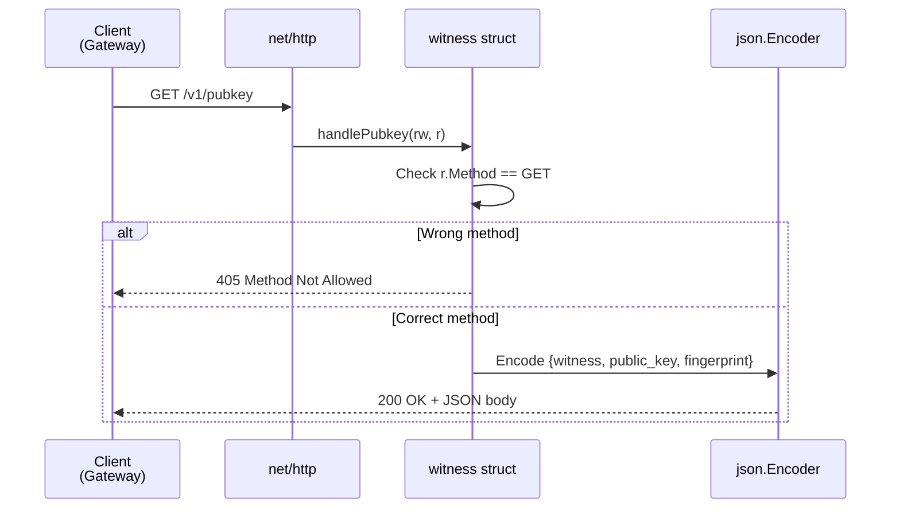

---

## 🔍 Real Code — `cmd/witness/main.go` Lines 82–93

```go
func (w *witness) handlePubkey(rw http.ResponseWriter, r *http.Request) {
//   ──────────── 
//   receiver: this method belongs to the "witness" struct
//   "w" is how we refer to THIS specific witness inside this function

    if r.Method != http.MethodGet {
        http.Error(rw, "GET required", http.StatusMethodNotAllowed)
        return  // Stop here — don't continue
    }

    rw.Header().Set("Content-Type", "application/json")

    json.NewEncoder(rw).Encode(map[string]string{
        "witness":     w.witnessName,                          // ← w. accesses the struct
        "public_key":  base64.StdEncoding.EncodeToString(w.pub),
        "fingerprint": w.fp,
    })
}
```

---

## 🔍 Real Code — `internal/iso8583/parser.go` Lines 91–101

```go
func (m *Message) AmountKES() float64 {
	s, ok := m.Fields[4]     // m.Fields is a map. Look up key "4" (the amount field)
	if !ok || s == "" {      // If key "4" not found, or it is blank...
		return 0             // ...amount is zero
	}
	n, err := strconv.ParseInt(strings.TrimLeft(s, "0 "), 10, 64)
	if err != nil {
		return 0
	}
	return float64(n) / 100.0
}
```

**Why divide by 100?**

```
  ISO 8583 stores money in CENTS (no decimal point):

  Raw field 4 value:  "000000100000"
                       ────────────
                       12 digits, zero-padded

  After TrimLeft:     "100000"   (removes leading zeros)
  After ParseInt:     100000     (integer: one hundred thousand cents)
  After / 100.0:      1000.00    (float64: one thousand KES)

  So "000000100000" in ISO 8583 = 1000.00 KES ✓
```

---

## ❓ Ask Why?

- **Why** do we declare `AmountKES` on `*Message` (pointer) instead of `Message` (value) if it is read-only?
- **Why** does Go allow us to write `w.witnessName` instead of `(*w).witnessName`?

*(Answers: 
1. Efficiency. Even if a method is read-only, passing the `Message` struct by value would copy the entire map of fields. Using a pointer receiver avoids copy overhead.
2. Go's compiler is designed to reduce boilerplate. It automatically converts `w.witnessName` to `(*w).witnessName` for pointers to structs, making the code much more readable.)*

---

## ✏️ Quiz 5A: Value Receiver (Read-Only)

Create `sandbox/quiz5a.go`. Write a program that:
1. Defines a struct `FeeCalculator` with fields `FixedFee` (float64) and `PercentageFee` (float64).
2. Adds a method `Calculate(amount float64) float64` with a **Value Receiver** (`f FeeCalculator`) that returns `FixedFee + (amount * PercentageFee)`.
3. In `main()`, instantiate `FeeCalculator` with a fixed fee of `50.00` and percentage fee of `0.01` (1%).
4. Call the `Calculate` method for a transaction of `10000.00` and print the result.

---

## ✅ Answer — Quiz 5A

```go
package main

import "fmt"

type FeeCalculator struct {
    FixedFee      float64
    PercentageFee float64
}

// Value receiver: f is a copy, read-only
func (f FeeCalculator) Calculate(amount float64) float64 {
    return f.FixedFee + (amount * f.PercentageFee)
}

func main() {
    calc := FeeCalculator{
        FixedFee:      50.00,
        PercentageFee: 0.01,
    }

    fee := calc.Calculate(10000.00)
    fmt.Printf("Total Fee: KES %.2f\n", fee)
}
```

**Expected Output:**
```
Total Fee: KES 150.00
```

---

## ✏️ Quiz 5B: Pointer Receiver (Mutating State)

Create `sandbox/quiz5b.go`. Write a program that:
1. Defines a struct `BankAccount` with fields `AccountHolder` (string) and `Balance` (float64).
2. Adds a method `Deposit(amount float64)` with a **Pointer Receiver** (`a *BankAccount`) that adds `amount` to the account `Balance`.
3. Adds a method `Withdraw(amount float64) bool` with a **Pointer Receiver** (`a *BankAccount`) that deducts `amount` if funds are sufficient, returning `true`. If funds are insufficient, it returns `false` and makes no changes.
4. In `main()`, create an account for `"John Doe"` with a balance of `500.00`.
5. Deposit `1000.00`. Withdraw `300.00`. Withdraw `2000.00`. Print the account balance after each step to verify correctness.

---

## ✅ Answer — Quiz 5B

```go
package main

import "fmt"

type BankAccount struct {
    AccountHolder string
    Balance       float64
}

// Pointer receiver: modifies the actual balance
func (a *BankAccount) Deposit(amount float64) {
    a.Balance += amount
}

// Pointer receiver: modifies balance and returns whether successful
func (a *BankAccount) Withdraw(amount float64) bool {
    if a.Balance < amount {
        return false
    }
    a.Balance -= amount
    return true
}

func main() {
    acc := &BankAccount{
        AccountHolder: "John Doe",
        Balance:       500.00,
    }

    fmt.Printf("Initial Balance: KES %.2f\n", acc.Balance)

    acc.Deposit(1000.00)
    fmt.Printf("After Deposit:   KES %.2f\n", acc.Balance)

    if acc.Withdraw(300.00) {
        fmt.Println("Withdrawal of 300.00 successful ✓")
    } else {
        fmt.Println("Withdrawal of 300.00 failed ❌")
    }
    fmt.Printf("Balance:         KES %.2f\n", acc.Balance)

    if acc.Withdraw(2000.00) {
        fmt.Println("Withdrawal of 2000.00 successful ✓")
    } else {
        fmt.Println("Withdrawal of 2000.00 failed ❌ (Insufficient Funds)")
    }
    fmt.Printf("Final Balance:   KES %.2f\n", acc.Balance)
}
```

**Expected Output:**
```
Initial Balance: KES 500.00
After Deposit:   KES 1500.00
Withdrawal of 300.00 successful ✓
Balance:         KES 1200.00
Withdrawal of 2000.00 failed ❌ (Insufficient Funds)
Final Balance:   KES 1200.00
```

**Common Mistakes & Pitfalls:**
- Declaring `Deposit` with a value receiver `(a BankAccount)`. If you do this, the function will compile, but when you call `acc.Deposit(1000.00)`, Go will pass a *copy* of `acc` to `Deposit`. The copy will have its balance increased, but the original `acc` variable in `main()` will remain unchanged!

---

# Chapter 6: Error Handling — Never Let Problems Go Silent

---

## 📖 The Analogy

```
  Imagine a bank teller who processes a transaction,
  the system rejects it internally, but the teller
  smiles and hands you a receipt saying "APPROVED."

  That is a catastrophe. In banking, silence = fraud risk.

  Go's rule: If a function CAN fail, it MUST tell you.
  Your rule:  If a function CAN fail, you MUST check it.
```

---

## The Error Interface Under the Hood

In Go, there is no `try/catch` mechanism. Instead, errors are treated as normal values. The language defines a built-in interface called `error`:

```go
type error interface {
    Error() string
}
```

Any struct that implements the `Error() string` method can be used as an error. When a function executes successfully, it returns `nil` for its error parameter. If something goes wrong, it returns an error object, which you must check immediately.

---

## The Error Handling Pattern — Visual

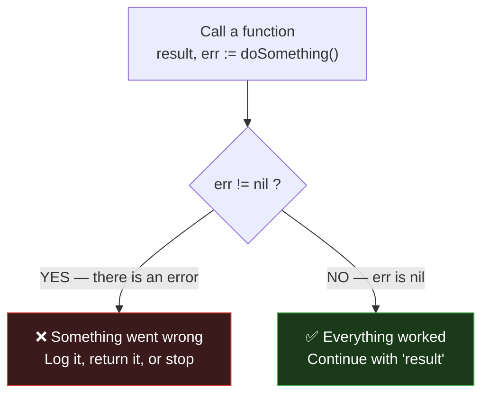

---

## Error Wrapping and Chaining

When an error happens deep inside your codebase (for example, SQLite fails to write to disk), passing that raw error all the way back up to the user is not very helpful. You want to add context (e.g., *"database write failed"*).

In Go, we do this using **Error Wrapping** via the `%w` formatting verb:

```go
return fmt.Errorf("database write failed: %w", err)
```

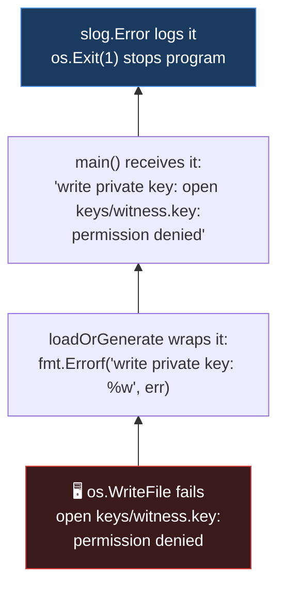

By wrapping errors with `%w`, we preserve the entire execution path.

### Inspecting Error Chains (`errors.Is` and `errors.As`)
Because errors are wrapped inside other errors, you cannot always do a simple equality check like `err == sql.ErrNoRows`. Go provides two key functions:
1. **`errors.Is(err, target)`:** Traverses the entire error chain to check if any error in the chain matches the `target`.
   ```go
   if errors.Is(err, sql.ErrNoRows) { // handle empty database case }
   ```
2. **`errors.As(err, &targetStruct)`:** Traverses the chain to check if any error matches a specific custom struct type, extracting it for you.

---

## 🔍 Real Code — `cmd/witness/main.go` Lines 47–63

```go
pub, priv, err := ed25519.GenerateKey(rand.Reader)
if err != nil {
    return nil, nil, fmt.Errorf("generate keypair: %w", err)
    //                           ───────────────    ──
    //                           context label      %w wraps the original error
}

// 0600 = file permissions: owner can read+write, nobody else can do anything
if err := os.WriteFile(privPath, priv, 0600); err != nil {
    return nil, nil, fmt.Errorf("write private key: %w", err)
}

// 0644 = file permissions: owner can write, everyone can read
if err := os.WriteFile(pubPath, pub, 0644); err != nil {
    return nil, nil, fmt.Errorf("write public key: %w", err)
}
```

**File permission cheat sheet:**

```
  0600  →  rw-------  →  Owner: read+write | Group: none | Others: none
  0644  →  rw-r--r--  →  Owner: read+write | Group: read | Others: read
  0700  →  rwx------  →  Owner: all        | Group: none | Others: none

  Private key = 0600  (the most secret — only YOU can touch it)
  Public key  = 0644  (meant to be shared — anyone can read it)
```

---

## ❓ Ask Why?

- **Why** does Go enforce checking `err != nil` manually instead of using automated exceptions?
- **Why** must we use `errors.Is(err, target)` instead of `err == target`?

*(Answers: 
1. Readability and predictability. Exceptions create hidden jumps in code execution, making it difficult to trace security vulnerabilities. Explicit error checking makes it obvious exactly where failure modes can occur.
2. If an error is wrapped using `fmt.Errorf("context: %w", err)`, the resulting error value is a new struct. A direct `==` check will fail. `errors.Is` unwraps the error layer-by-layer to check the original root cause.)*

---

## ✏️ Quiz 6A: Error Wrapping and Propagation

Create `sandbox/quiz6a.go`. Write a program that:
1. Defines a function `checkDatabaseConnection() error` that returns a raw error: `errors.New("connection timeout")`.
2. Defines a function `initializeLedger() error` that calls `checkDatabaseConnection()`. If it returns an error, wrap it: `fmt.Errorf("initialize ledger: %w", err)`.
3. In `main()`, call `initializeLedger()`. If it returns an error, print the full chain message and print the unwrapped root error using `errors.Unwrap()`.

---

## ✅ Answer — Quiz 6A

```go
package main

import (
    "errors"
    "fmt"
)

func checkDatabaseConnection() error {
    return errors.New("connection timeout")
}

func initializeLedger() error {
    err := checkDatabaseConnection()
    if err != nil {
        return fmt.Errorf("initialize ledger: %w", err) // Wrap error with %w
    }
    return nil
}

func main() {
    err := initializeLedger()
    if err != nil {
        fmt.Println("Full Error Chain:", err)
        
        // Unwrap to find the root cause
        rootErr := errors.Unwrap(err)
        fmt.Println("Root Cause:", rootErr)
        return
    }
    fmt.Println("Ledger initialized successfully!")
}
```

**Expected Output:**
```
Full Error Chain: initialize ledger: connection timeout
Root Cause: connection timeout
```

---

## ✏️ Quiz 6B: Custom Errors & `errors.Is` / `errors.As`

Create `sandbox/quiz6b.go`. Write a program that:
1. Defines a custom struct error `FundError` with fields `Required KES` (float64) and `Available KES` (float64). It must implement the `Error() string` method returning `"insufficient funds: need KES X, only have KES Y"`.
2. Defines a package constant `ErrSystemMaintenance = errors.New("system undergoing maintenance")`.
3. Write a function `processPayment(amount float64, balance float64, maintenance bool) error`:
   - If `maintenance` is `true`, return `ErrSystemMaintenance`.
   - If `amount > balance`, return an instance of `*FundError`.
   - Otherwise, return `nil`.
4. In `main()`, call `processPayment(1000.00, 500.00, false)`. Check if it is a `*FundError` using `errors.As`. If so, print the fields.
5. In `main()`, call `processPayment(100.00, 500.00, true)`. Check if it matches `ErrSystemMaintenance` using `errors.Is`. If so, print `"Retry transaction later"`.

---

## ✅ Answer — Quiz 6B

```go
package main

import (
    "errors"
    "fmt"
)

// Custom error struct
type FundError struct {
    Required  float64
    Available float64
}

// Implement the error interface
func (e *FundError) Error() string {
    return fmt.Sprintf("insufficient funds: need KES %.2f, only have KES %.2f", e.Required, e.Available)
}

// Standard sentinel error
var ErrSystemMaintenance = errors.New("system undergoing maintenance")

func processPayment(amount float64, balance float64, maintenance bool) error {
    if maintenance {
        return ErrSystemMaintenance
    }
    if amount > balance {
        return &FundError{Required: amount, Available: balance}
    }
    return nil
}

func main() {
    // Test Case 1: Insufficient funds
    fmt.Println("--- Test Case 1 ---")
    err1 := processPayment(1000.00, 500.00, false)
    if err1 != nil {
        var fundErr *FundError
        if errors.As(err1, &fundErr) { // extract custom error fields
            fmt.Println("Fund Error caught!")
            fmt.Printf("Required: KES %.2f, Available: KES %.2f\n", fundErr.Required, fundErr.Available)
        } else {
            fmt.Println("Other error:", err1)
        }
    }

    // Test Case 2: System maintenance
    fmt.Println("\n--- Test Case 2 ---")
    err2 := processPayment(100.00, 500.00, true)
    if err2 != nil {
        if errors.Is(err2, ErrSystemMaintenance) {
            fmt.Println("Error: System is currently down for maintenance.")
            fmt.Println("Action: Retry transaction later.")
        } else {
            fmt.Println("Other error:", err2)
        }
    }
}
```

**Expected Output:**
```
--- Test Case 1 ---
Fund Error caught!
Required: KES 1000.00, Available: KES 500.00

--- Test Case 2 ---
Error: System is currently down for maintenance.
Action: Retry transaction later.
```

---

## 🔄 Review Checkpoint 3

Answer from memory:

1. What is the built-in `error` interface definition in Go?
2. What formatting verb do you use to wrap an error inside another?
3. What is the difference between `errors.Is` and `errors.As`?
4. Why does a custom error struct implementation usually use a pointer receiver for its `Error()` method?
5. Write the syntax to unwrap a wrapped error value `err`.

---

---

# Chapter 7: Goroutines & Channels — Running Code Simultaneously

---

## 📖 The Analogy

```
  You need signatures from 3 bank officers: Alpha, Beta, Gamma.

  SEQUENTIAL (bad):                    PARALLEL with goroutines (good):
  ─────────────────                    ────────────────────────────────
  Walk to Alpha → wait → sign          Send all 3 requests at once:
  Walk to Beta  → wait → sign
  Walk to Gamma → wait → sign          Alpha ──────────┐
                                       Beta  ───────────┼──→ all working at the same time
  Total: 150ms                         Gamma ────────────┘
                                       Total: ~50ms (fastest wins the deadline)
```

---

## Concurrency vs. Parallelism

Many programmers confuse **concurrency** and **parallelism**:
- **Concurrency** is about **structure**. It is the ability to write your program so that multiple tasks can start, run, and complete in overlapping time periods. Think of a single teller multitasking between two lines of customers.
- **Parallelism** is about **execution**. It is the ability to run multiple tasks *literally* at the same physical instant, which requires multi-core processor hardware. Think of two tellers serving two customers at the same time.

In Go, we launch a concurrent task by placing the `go` keyword before a function call. This starts a **Goroutine** — a lightweight thread managed by the Go runtime, not the operating system.

---

## Channels: The Communication Pipes

If two goroutines need to talk or share data, they must **never** share memory directly (like editing the same variable), as this causes race conditions. Instead, they use a **Channel** to pass messages back and forth.

```
       ch := make(chan int) // Create a channel of integers

       ch <- 42  // Send value 42 into the channel
       val := <-ch // Receive value from the channel and save it in val
```

### Unbuffered vs. Buffered Channels
1. **Unbuffered Channels (Default):**
   `ch := make(chan string)`
   A send operation blocks the sender until a receiver is ready to take the value. A receive blocks the receiver until a sender puts a value in. It acts as a synchronous handshake.
2. **Buffered Channels:**
   `ch := make(chan string, 3)`
   The channel has a mailbox slot of size `3`. A sender can push up to 3 messages into the channel without blocking, even if no one is reading yet. Once the buffer is full, the sender blocks.

---

## The `select` Statement and timeouts

The `select` statement lets a goroutine wait on multiple channel operations at the same time. It blocks until one of its cases is ready to execute:

```go
select {
case msg := <-ch:
    fmt.Println("Received message:", msg)
case <-time.After(100 * time.Millisecond):
    fmt.Println("Timed out waiting!")
}
```

This is how the CONNEX Gateway prevents a slow or crashed witness node from blocking bank payments. We fire requests to all witnesses, wait for responses, but enforce a strict timeout using `time.After`.

---

## Sequential vs Parallel — Timeline

```mermaid
gantt
    title Transaction Signing: Sequential vs Parallel
    dateFormat X
    axisFormat %Lms

    section Sequential (150ms total)
    Ask Witness Alpha  :crit, s1, 0, 50
    Ask Witness Beta   :crit, s2, 50, 100
    Ask Witness Gamma  :crit, s3, 100, 150

    section Parallel with Goroutines (~50ms total)
    Ask Witness Alpha  :active, p1, 0, 50
    Ask Witness Beta   :active, p2, 0, 50
    Ask Witness Gamma  :active, p3, 0, 50
```

---

## Goroutines + Channels — How They Communicate

```
  GOROUTINE                         MAIN CODE
  ─────────                         ─────────
  Does its work in background       Waits for results
                │                         │
                │  ch <- result{sig, err} │
                └──────────────────────►  │  r := <-ch
                      the CHANNEL         │  (receive result)
                      (the pipe)

  Three goroutines, one channel:

  Goroutine Alpha ──┐
                    │
  Goroutine Beta  ──┼──► ch (channel pipe) ──► main code collects results
                    │
  Goroutine Gamma ──┘
```

---

## 🔍 Real Code — `cmd/gateway/main.go` Lines 87–121

```go
func collectSignatures(witnesses []string, tokens []string, hashBytes []byte, timeout time.Duration) []SignatureEntry {
	type result struct {
		sig *SignatureEntry
		err error
	}
	ch := make(chan result, len(witnesses))
	for i, w := range witnesses {
		w := w
		var token string
		if i < len(tokens) {
			token = tokens[i]
		}
		go func() {
			sig, err := requestSignature(w, token, hashBytes, timeout)
			ch <- result{sig, err}
		}()
	}

	var sigs []SignatureEntry
	deadline := time.After(timeout)
	for range witnesses {
		select {
		case r := <-ch:
			if r.err != nil {
				slog.Warn("witness error", "err", r.err)
			} else {
				sigs = append(sigs, *r.sig)
			}
		case <-deadline:
			slog.Warn("witness timeout reached", "collected", len(sigs))
			return sigs
		}
	}
	return sigs
}
```

**Why `w := w` before the goroutine?**

```
  WITHOUT w := w:           WITH w := w:
  ───────────────           ────────────
  Loop runs 3 times.        Loop runs 3 times.
  All 3 goroutines          Each goroutine gets
  share the SAME "w"        its OWN private copy
  variable. By the          of "w". They cannot
  time they run, "w"        interfere with each
  might be "gamma"          other.
  for all three! ❌          ✓
```

---

## How quorum works — the `select` statement

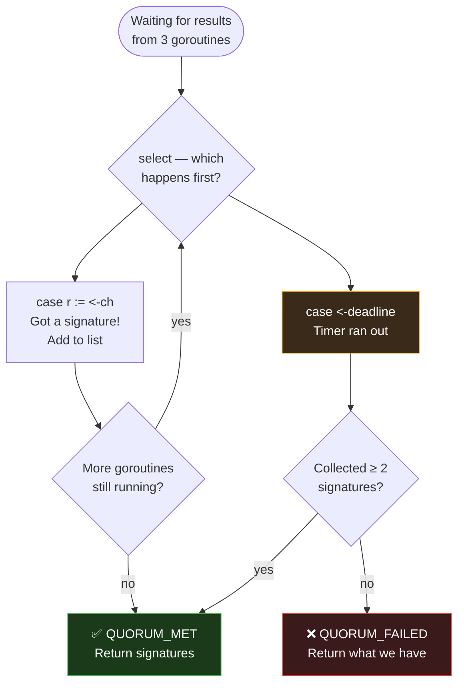

---

## ❓ Ask Why?

- **Why** do we buffer the channel `ch := make(chan result, len(witnesses))` instead of leaving it unbuffered?
- **Why** does Go warn us that launching a goroutine without variable capture (the `w := w` pattern) is a security hazard?

*(Answers: 
1. If the channel is unbuffered, and the gateway times out (executing `case <-deadline`), it returns immediately. The running background goroutines will finish later and try to send their result to `ch`, but since no one is reading anymore, they will block forever, creating a memory leak. Buffering allows the goroutines to write their results and exit cleanly.
2. In older versions of Go, loop variables were updated in place. If three goroutines references the same loop pointer `w`, they would all read whatever value was in `w` at the time of execution — usually the final element `"gamma"`. Capturing variables ensures each goroutine gets its own local copy.)*

---

## ✏️ Quiz 7A: Buffered Channels and Goroutines

Create `sandbox/quiz7a.go`. Write a program that:
1. Creates a buffered channel of strings named `jobs` with capacity `3`.
2. Launches a background goroutine that reads 3 strings from the channel, printing `"Processing: " + job` for each, sleep `100ms` between them.
3. In `main()`, send three strings to the channel: `"Verify MTI"`, `"Validate Bitmap"`, and `"Hash Transaction"`.
4. Sleep for `500ms` at the end of `main()` to allow the background goroutine to finish.

---

## ✅ Answer — Quiz 7A

```go
package main

import (
    "fmt"
    "time"
)

func worker(jobs chan string) {
    for i := 0; i < 3; i++ {
        job := <-jobs // Receive job from channel
        fmt.Println("Processing:", job)
        time.Sleep(100 * time.Millisecond)
    }
}

func main() {
    jobs := make(chan string, 3) // Buffered channel

    // Launch worker goroutine in background
    go worker(jobs)

    // Send jobs to channel
    jobs <- "Verify MTI"
    jobs <- "Validate Bitmap"
    jobs <- "Hash Transaction"

    fmt.Println("All jobs queued!")

    // Sleep to let worker finish before main exits
    time.Sleep(500 * time.Millisecond)
}
```

**Expected Output:**
```
All jobs queued!
Processing: Verify MTI
Processing: Validate Bitmap
Processing: Hash Transaction
```

---

## ✏️ Quiz 7B: Select Statement & Timeouts

Create `sandbox/quiz7b.go`. Write a program that:
1. Creates an unbuffered channel of strings `response`.
2. Launches a goroutine that sleeps `2` seconds and then sends `"Alpha Approved ✓"` to `response`.
3. In `main()`, use a `select` statement to wait on the channel:
   - If a message arrives, print it.
   - If `1` second passes (using `time.After(1 * time.Second)`), print `"⏰ Timeout reached! Payment rejected."` and exit.
4. Modify the timeout to `3` seconds and run again to see the success path.

---

## ✅ Answer — Quiz 7B

```go
package main

import (
    "fmt"
    "time"
)

func simulateWitness(ch chan string) {
    time.Sleep(2 * time.Second)
    ch <- "Alpha Approved ✓"
}

func main() {
    response := make(chan string)

    go simulateWitness(response)

    // Test Case 1: Timeout shorter than response
    fmt.Println("--- Running with 1-second timeout ---")
    select {
    case msg := <-response:
        fmt.Println("Received:", msg)
    case <-time.After(1 * time.Second):
        fmt.Println("⏰ Timeout reached! Payment rejected.")
    }

    // Note: To run Test Case 2 cleanly, we instantiate another channel
    response2 := make(chan string)
    go simulateWitness(response2)

    fmt.Println("\n--- Running with 3-second timeout ---")
    select {
    case msg := <-response2:
        fmt.Println("Received:", msg)
    case <-time.After(3 * time.Second):
        fmt.Println("⏰ Timeout reached! Payment rejected.")
    }
}
```

**Expected Output:**
```
--- Running with 1-second timeout ---
⏰ Timeout reached! Payment rejected.

--- Running with 3-second timeout ---
Received: Alpha Approved ✓
```

---

## 🔄 Review Checkpoint 4 — Interleaved (All Chapters Mixed)

Answer from memory — these questions mix all 7 chapters deliberately:

1. **(Ch.1)** What happens if you `import "fmt"` and never use `fmt` in your code?
2. **(Ch.2)** What is the difference between `string` and `[]byte`?
3. **(Ch.3)** What does lowercase field names in a struct mean vs uppercase?
4. **(Ch.4)** Write the 3-line `sha256Hex` function completely from memory.
5. **(Ch.5)** In `func (m *Message) AmountKES() float64`, what does `*` mean?
6. **(Ch.6)** What does `fmt.Errorf("context: %w", err)` do differently than `%v`?
7. **(Ch.7)** What is a channel? What do `<-` and `->` do?

---

---

# Chapter 8: The Full Picture — Code Walkthroughs

---

## Every Step a Bank Transaction Takes in CONNEX

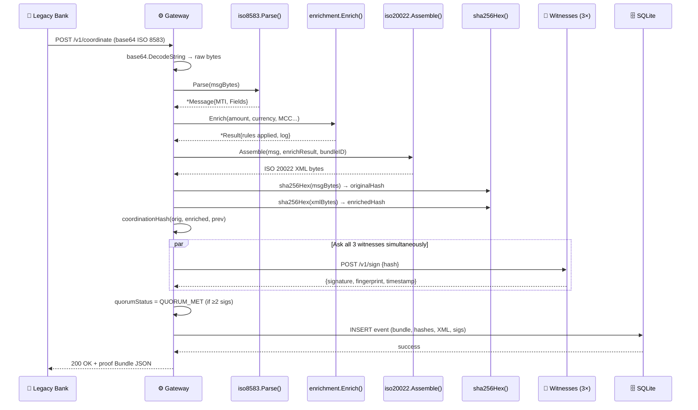

---

## Walkthrough 1: `internal/iso8583/parser.go`

Let's dissect the core parser logic that reads the ISO 8583 bitmap and dynamic fields.

### 1. The Bitmap Field Decoder (`bitmapBits`)
```go
func bitmapBits(raw []byte, offset int) []int {
    var set []int
    for byteIdx, b := range raw {
        for bit := 7; bit >= 0; bit-- {
            if (b>>uint(bit))&1 == 1 {
                fieldNum := offset + byteIdx*8 + (7 - bit) + 1
                set = append(set, fieldNum)
            }
        }
    }
    return set
}
```
**Line-by-Line Annotation:**
- `raw []byte`: 8 bytes of bitmap data (representing fields 1–64 or 65–128).
- `offset int`: 0 for primary bitmap, 64 for secondary bitmap.
- `for byteIdx, b := range raw`: Loops through all 8 bytes of the bitmap.
- `for bit := 7; bit >= 0; bit--`: Loops through each bit of the current byte from left (most significant) to right.
- `b>>uint(bit)`: Bitwise shifts the byte `b` to the right by `bit` positions, moving the target bit to the least significant position.
- `&1 == 1`: Bitwise ANDs with `1` to isolate the target bit. If the result is `1`, that field number is present!
- `fieldNum := offset + byteIdx*8 + (7 - bit) + 1`: Math to map the current bit position to the actual ISO field number.
- `set = append(set, fieldNum)`: Adds the field number to our list.

---

### 2. Variable-Length Field Parsing (LLVAR / LLLVAR)
Let's see how the parser decodes ASCII variable-length data fields (like a bank account card number in field 2):
```go
lenStr := string(raw[pos : pos+2])
dataLen, err := strconv.Atoi(lenStr)
if err != nil {
    return nil, fmt.Errorf("F%d (%s): invalid LLVAR length %q", fieldNum, def.Name, lenStr)
}
pos += 2
if dataLen > def.Length {
    return nil, fmt.Errorf("F%d (%s): LLVAR length %d exceeds max %d", fieldNum, def.Name, dataLen, def.Length)
}
msg.Fields[fieldNum] = string(raw[pos : pos+dataLen])
pos += dataLen
```
**Line-by-Line Annotation:**
- `string(raw[pos : pos+2])`: Slices the next 2 bytes of the message stream and converts them to string (e.g. `"16"`). This represents the length of the account card number.
- `strconv.Atoi(lenStr)`: Parses `"16"` into the integer `16`.
- `pos += 2`: Advances the stream pointer past the 2-digit length prefix.
- `dataLen > def.Length`: Security validation. Verifies the length doesn't exceed the database schema boundaries.
- `string(raw[pos : pos+dataLen])`: Extracts the card number bytes and stores them as a string value inside our `msg.Fields` map.
- `pos += dataLen`: Advances the stream pointer past the actual data fields.

---

## Walkthrough 2: `cmd/witness/main.go`

The witness node generates private keys, restricts file system access, and binds timestamps to prevent signature replay attacks.

### 1. Key Generation and Secure File Permissions
```go
if err := os.WriteFile(privPath, priv, 0600); err != nil {
    return nil, nil, fmt.Errorf("write private key: %w", err)
}
if err := os.WriteFile(pubPath, pub, 0644); err != nil {
    return nil, nil, fmt.Errorf("write public key: %w", err)
}
```
**Line-by-Line Annotation:**
- `os.WriteFile(...)`: Atomically creates or overwrites the file on disk.
- `privPath`: The target file location (e.g., `"keys/witness.key"`).
- `0600`: Standard POSIX file permissions. Only the operating system user running the process can read and write the private key. Everyone else is denied.
- `0644`: Public key permissions. Public keys are designed to be shared, so this enables others to read the public key while allowing only the owner to write/modify it.
- `fmt.Errorf("write private key: %w", err)`: Error wrapping to bubble the exact file system failure up to the startup logger.

---

### 2. Temporal Cryptographic Binding (`handleSign`)
```go
timestamp := time.Now().UTC().Format(time.RFC3339Nano)

h := sha256.New()
h.Write(hashBytes)
h.Write([]byte(timestamp))
witnessHash := h.Sum(nil)

sig := ed25519.Sign(w.priv, witnessHash)
```
**Line-by-Line Annotation:**
- `time.Now().UTC().Format(time.RFC3339Nano)`: Generates a high-precision UTC timestamp string.
- `sha256.New()`: Initializes a SHA-256 hash calculator.
- `h.Write(hashBytes)`: Feeds the 32-byte transaction coordination hash into the hash calculator.
- `h.Write([]byte(timestamp))`: Feeds the timestamp string into the hash calculator.
- `h.Sum(nil)`: Seals the hash calculator, computing `witnessHash = SHA-256(H_coord || timestamp_bytes)`.
- `ed25519.Sign(w.priv, witnessHash)`: Signs the combined hash using the private key. 
- *Why bind time?* If a hacker intercepts the signature, they cannot reuse it for another transaction later, because the signature is mathematically bound to a specific millisecond timestamp.

---

## Walkthrough 3: `cmd/gateway/main.go`

The gateway controls the sequence of transaction chaining and executes parallel network calls to gather witness signatures.

### 1. Coordination Sequence Lock
```go
g.mu.Lock()
defer g.mu.Unlock()

prevHash, err := g.db.LatestChainHash()
```
**Line-by-Line Annotation:**
- `g.mu.Lock()`: Acquires a mutual exclusion lock (**Mutex**). If another web request is currently executing a payment, this thread blocks and waits.
- `defer g.mu.Unlock()`: Ensures the mutex is released when this function exits (even if the transaction fails midway).
- `g.db.LatestChainHash()`: Reads the hash of the last successfully processed transaction.
- *Why is a lock necessary?* To maintain an unbroken hash chain. If two transactions are processed simultaneously without a mutex, they might read the same `prevHash`, generating a fork in our transaction chain.

---

### 2. Parallel Signature Gathering (`collectSignatures`)
```go
ch := make(chan result, len(witnesses))
for i, w := range witnesses {
    w := w
    var token string
    if i < len(tokens) {
        token = tokens[i]
    }
    go func() {
        sig, err := requestSignature(w, token, hashBytes, timeout)
        ch <- result{sig, err}
    }()
}
```
**Line-by-Line Annotation:**
- `ch := make(chan result, len(witnesses))`: Creates a buffered channel that holds `len(witnesses)` result structs, preventing goroutines from blocking.
- `for i, w := range witnesses`: Iterates over the addresses of our three witness servers.
- `w := w`: Local variable capture. Creates a copy of `w` inside the loop scope so the goroutine doesn't reference a moving loop pointer.
- `go func() { ... }()`: Spawns an anonymous background goroutine immediately.
- `requestSignature(...)`: Executes a POST network request to the witness.
- `ch <- result{sig, err}`: Pushes the network response (or error) into our channel mailbox.

---

## Walkthrough 4: `internal/storage/db.go`

The database interface manages SQL commands and handles high-concurrency settings to guarantee ledger write integrity.

### 1. WAL Mode & Busy Timeout Configurations
```go
conn, err := sql.Open("sqlite", path+"?_journal=WAL&_busy_timeout=5000")
```
**Line-by-Line Annotation:**
- `sql.Open("sqlite", ...)`: Initializes the database driver connection pool.
- `_journal=WAL`: Enables **Write-Ahead Logging** (WAL). This permits multiple read operations to occur simultaneously while a write operation is running, preventing database contention.
- `_busy_timeout=5000`: Set to 5000 milliseconds. If the database is temporarily locked by another process, wait up to 5 seconds before returning a lock error to the application.

---

### 2. Inserting Transaction Records
```go
_, err := db.conn.Exec(`
    INSERT INTO coordination_events
      (bundle_id, timestamp, original_hash, enriched_hash, chain_hash,
       prev_chain_hash, bundle_json, enriched_xml, enrichment_log, quorum_status)
    VALUES (?, ?, ?, ?, ?, ?, ?, ?, ?, ?)`,
    e.BundleID,
    e.Timestamp.UTC().Format(time.RFC3339Nano),
    e.OriginalHash,
    e.EnrichedHash,
    e.ChainHash,
    e.PrevChainHash,
    e.BundleJSON,
    e.EnrichedXML,
    e.EnrichmentLog,
    e.QuorumStatus,
)
```
**Line-by-Line Annotation:**
- `db.conn.Exec(...)`: Runs the SQL query directly.
- `?`: SQL parameter placeholders. These prevent **SQL Injection** security vulnerabilities. Go's driver handles escaping the input data safely.
- `e.Timestamp.UTC().Format(...)`: Converts the timestamp to UTC and formats it with nano-precision before storing it in the database.

---

## ✏️ Chapter 8 Final Challenge: Gateway Code Mapping

Open `cmd/gateway/main.go`. Find `handleCoordinate()` at line 148. It has **12 numbered steps** in the comments. For each step, identify which chapter from this course that code concept comes from.

```
  Step 1:  Read and decode base64 body         → Chapter ___
  Step 2:  Parse ISO 8583                       → Chapter ___
  Step 3:  Run enrichment engine               → Chapter ___
  Step 4:  Generate bundle ID                   → Chapter ___
  Step 5:  Compute hashes                       → Chapter ___
  Step 6:  Lock coordination (sync.Mutex)       → Chapter ___
  Step 7:  Compute coordination hash            → Chapter ___
  Step 8:  Collect witness signatures           → Chapter ___
  Step 9:  Build enrichment log JSON            → Chapter ___
  Step 10: Assemble proof bundle               → Chapter ___
  Step 11: Write to SQLite                      → Chapter ___
  Step 12: Return bundle JSON                   → Chapter ___
```

---

## 📅 Recommended Study Schedule

```
  ┌─────────┬────────────────────────────────────────────────────────┐
  │  Day 1  │  Chapters 1–2, Quizzes 1–2                             │
  │  Day 2  │  Review Checkpoint 1, Chapter 3, Quiz 3               │
  │  Day 3  │  Chapters 4–5, Quizzes 4–5, Review Checkpoint 2       │
  │  Day 5  │  Re-do Quizzes 1–3 from memory (spaced repetition)    │
  │  Day 6  │  Chapters 6–7, Quizzes 6–7, Review Checkpoint 3       │
  │  Day 7  │  Chapter 8 Final Challenge + Review Checkpoint 4       │
  │  Day 10 │  Re-do ALL quizzes from memory                         │
  │  Day 14 │  Read cmd/gateway/main.go top to bottom, annotate it  │
  └─────────┴────────────────────────────────────────────────────────┘

  Research finding: 1 focused hour per day beats 7 hours in one sitting.
```

🏆 **Congratulations! You have completed the CONNEX Go Programming Course. You are now ready to write and review production code for the coordination engine!**

