<picture>
  <source media="(prefers-color-scheme: dark)" srcset="connex_logo_dark.png">
  <source media="(prefers-color-scheme: light)" srcset="connex_logo_light.png">
  
</picture>

---

# Go Programming: Learn by Reading CONNEX
### A Beginner's Course Built From the Real Banking System

---

## How This Course Was Built — The Science of Learning

Every section uses techniques proven by cognitive science to make learning stick:

```
┌─────────────────────────────────────────────────────────────────────────┐
│                    8 TECHNIQUES IN THIS COURSE                          │
├───────────────────────┬─────────────────────────────────────────────────┤
│  Active Recall        │  Write it yourself before seeing the answer     │
│  Spaced Repetition    │  Review checkpoints bring old topics back       │
│  Interleaving         │  Later quizzes mix multiple chapters together   │
│  Feynman Technique    │  "Teach It Back" prompt after every chapter     │
│  Elaborative Inquiry  │  "Ask Why?" section after every real code block │
│  Concrete Examples    │  Analogy before definition, every time          │
│  Chunking             │  One concept per chapter, never more            │
│  Immediate Practice   │  Quiz appears right after the lesson            │
└───────────────────────┴─────────────────────────────────────────────────┘
```

> ⚠️ **Safety Rule:** Create a folder called `sandbox/` on your Desktop. ALL practice goes there. Never edit `cmd/` or `internal/`. You cannot break the bank from your sandbox.

---

## The Big Picture — What You Are Learning To Read

Before you write a single line, understand what CONNEX actually is:

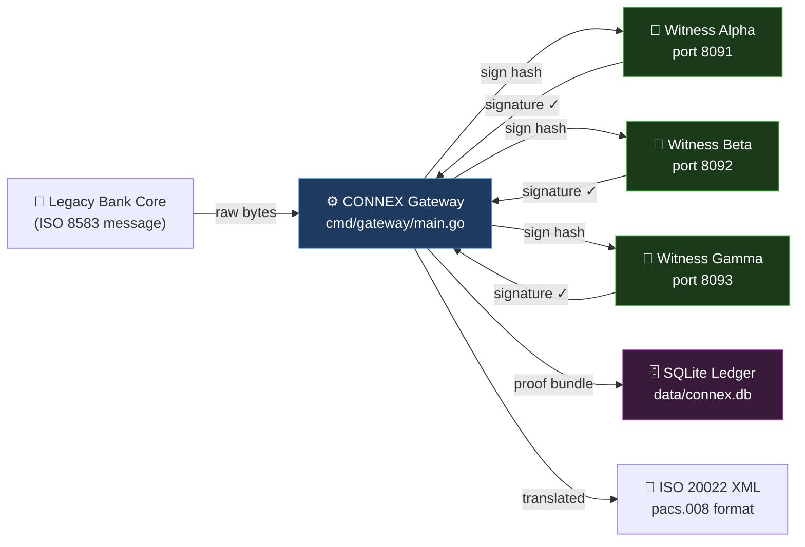

**This course teaches you Go by reading every file shown above, line by line.**

---

## Your Study Roadmap

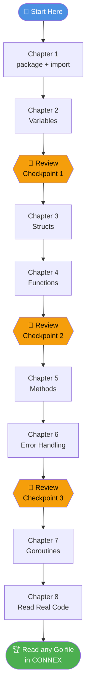

---

---

# Chapter 1: Packages and Imports

---

## 📖 The Analogy

```
Before cooking, a chef does two things:

  1. Declares the kitchen:  "This is the MAIN kitchen — not a prep room."
  2. Gathers tools:         knife, pot, measuring cup, timer

In Go:

  package main   =   "This is the main kitchen — a runnable program."
  import (...)   =   "These are the tools I need from the supply room."
```

---

## How Imports Work — Visual

```
  The Go Standard Library (built-in toolboxes)
  ┌────────────────────────────────────────────────────────────┐
  │                                                            │
  │  crypto/          encoding/       net/         os          │
  │  ├── ed25519      ├── base64      └── http     log/slog   │
  │  ├── rand         ├── hex                      flag        │
  │  └── sha256       └── json        time         fmt         │
  │                                   path/filepath            │
  └────────────────────────────────────────────────────────────┘
              │                │                │
              ▼                ▼                ▼
       cmd/witness/main.go imports only what it needs:
       "crypto/ed25519", "fmt", "net/http", "time", ...
```

---

## 🔍 Real Code — `cmd/witness/main.go` Lines 11–27

```go
package main

import (
    "crypto/ed25519"   // 🔑 Ed25519 cryptographic signatures
    "crypto/rand"      // 🎲 Secure random number generator
    "crypto/sha256"    // 🔒 SHA-256 hashing
    "encoding/base64"  // 📝 Binary bytes → readable Base64 text
    "encoding/hex"     // 🖊️  Binary bytes → hex string like "3f8a1c"
    "encoding/json"    // 📋 Read and write JSON
    "flag"             // 🚩 Read command-line arguments
    "fmt"              // 🖨️  Format and print text
    "log/slog"         // 📓 Structured log messages (key=value pairs)
    "net/http"         // 🌐 Build web servers, make HTTP requests
    "os"               // 💾 Read/write files, talk to the OS
    "path/filepath"    // 📁 Work with file paths safely on any OS
    "time"             // ⏰ Dates, clocks, timers, durations
)
```

**Why import so many?** The Witness Node does many jobs at once:

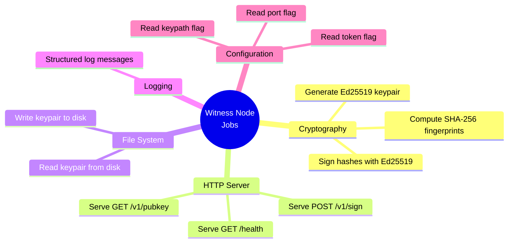

Each job needs its own toolbox.

---

## ❓ Ask Why?

- **Why** does Go refuse to compile if you import a toolbox and never use it?
- **Why** does `"crypto/sha256"` use a `/` and not a dot like other languages?

*(Answer #1: Unused imports are a sign of lazy or copy-pasted code. In banking software, every dependency is a potential security risk. Go forces you to be intentional.)*

---

## 🧠 Feynman Check

Close this. Write in a notepad: *"What does `package main` mean, and why do we write `import`?"* — in your own words, as if explaining to a 10-year-old.

---

## ✏️ Quiz 1

Create `sandbox/quiz1.go`. Write a program that:
1. Declares `package main`
2. Imports only `fmt` and `time`
3. Prints: `"CONNEX Witness — Online"`
4. Prints the current time

Run with: `go run quiz1.go`

---

## ✅ Answer — Quiz 1

```go
package main

import (
    "fmt"
    "time"
)

func main() {
    fmt.Println("CONNEX Witness — Online")
    fmt.Println("Current time:", time.Now())
}
```

**Expected output:**
```
CONNEX Witness — Online
Current time: 2026-05-27 18:51:00.123456789 +0300 EAT
```

**Common mistake:** Writing two separate `import "fmt"` and `import "time"` lines. Always use the parenthesis block for multiple imports.

---

---

# Chapter 2: Variables — Storing Data

---

## 📖 The Analogy

```
Your computer's RAM is like a desk with Post-it notes.

  ┌──────────┐  ┌──────────┐  ┌──────────┐  ┌──────────┐
  │ bankName │  │  amount  │  │ balance  │  │ isOnline │
  │          │  │          │  │          │  │          │
  │ "Equity" │  │   1247   │  │ 98750.50 │  │   true   │
  │  string  │  │   int    │  │ float64  │  │   bool   │
  └──────────┘  └──────────┘  └──────────┘  └──────────┘

  Each Post-it = one variable
  The label    = the variable name
  The value    = what is stored inside
  The type     = what kind of data it can hold

  When the program ends → all Post-its are thrown away (RAM is cleared)
```

---

## Data Types — The Complete Reference

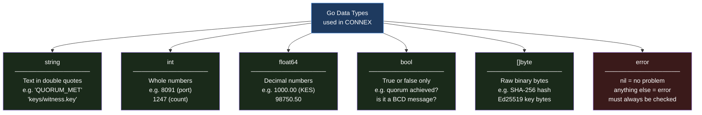

---

## 🔍 Real Code — `cmd/witness/main.go` Lines 34–35

```go
privPath := keyPath          // Box "privPath" gets a copy of keyPath's value
pubPath  := keyPath + ".pub" // Box "pubPath" gets keyPath + ".pub" glued on
```

**The `:=` operator does TWO things at once:**

```
  privPath  :=  keyPath
  ────────  ──  ───────
  Create     Do  Copy the
  a new box  it  value in
  named      at  here
  privPath   the
             same
             time
```

If `keyPath = "keys/witness.key"`:
```
  Before:          After:
  ┌──────────┐     ┌──────────────────┐  ┌────────────────────────┐
  │ keyPath  │     │    privPath      │  │       pubPath          │
  │          │ ──► │                  │  │                        │
  │"keys/    │     │"keys/witness.key"│  │"keys/witness.key.pub"  │
  │witness   │     └──────────────────┘  └────────────────────────┘
  │.key"     │
  └──────────┘
```

---

## 🔍 Real Code — Bundle ID Creation — `cmd/gateway/main.go` Line 198

```go
bundleID := fmt.Sprintf("CX-%s-%x", time.Now().UTC().Format("20060102150405.000000"), randBytes)
```

**Unwrapped piece by piece:**

```
"CX - %s - %x"
  │    │    └── %x = these bytes printed as hex: "3f8a1c2b"
  │    └─────── %s = this string goes here
  └──────────── fixed prefix for all CONNEX bundles

time.Now().UTC()                      = the current moment in UTC
  .Format("20060102150405.000000")    = "20260522154100.000000"
                                         ────┬────────────────
                                       YYYYMMDDHHMMSS.microseconds

randBytes                             = 4 random bytes → "3f8a1c2b" in hex

Result: "CX-20260522154100.000000-3f8a1c2b"
```

Every transaction in history gets a unique ID because time + randomness = uniqueness.

---

## ❓ Ask Why?

- **Why** does CONNEX store money as `float64` and not just `int`?
- **Why** does Go's time format use `"20060102"` instead of `"YYYYMMDD"` like other languages?

*(Answer #2: Go's time package uses a specific reference moment — January 2, 2006, 15:04:05 — as its template. The numbers 1,2,3,4,5,6 represent month,day,hour,minute,second,year in order. This is quirky but memorable once you know it.)*

---

## ✏️ Quiz 2

Create `sandbox/quiz2.go`. Create these variables and print them in a formatted sentence:

| Variable | Type | Value |
|----------|------|-------|
| `bankName` | `string` | `"Central Bank of Kenya"` |
| `transactionCount` | `int` | `1247` |
| `totalAmountKES` | `float64` | `98750.50` |
| `systemOnline` | `bool` | `true` |
| `witnessPort` | `int` | `8091` |

Required output:
```
Bank: Central Bank of Kenya | Transactions: 1247 | Total: KES 98750.50 | Port: 8091 | Online: true
```

---

## ✅ Answer — Quiz 2

```go
package main

import "fmt"

func main() {
    bankName         := "Central Bank of Kenya"
    transactionCount := 1247
    totalAmountKES   := 98750.50
    systemOnline     := true
    witnessPort      := 8091

    fmt.Printf("Bank: %s | Transactions: %d | Total: KES %.2f | Port: %d | Online: %v\n",
        bankName, transactionCount, totalAmountKES, witnessPort, systemOnline)
}
```

**Format verb cheat sheet:**

```
  ┌──────┬────────────────────────────┬────────────────┐
  │ Verb │ Use for                    │ Example output │
  ├──────┼────────────────────────────┼────────────────┤
  │  %s  │ string                     │ Central Bank   │
  │  %d  │ integer                    │ 1247           │
  │ %.2f │ float (2 decimal places)   │ 98750.50       │
  │  %v  │ anything (default format)  │ true           │
  │  %x  │ bytes as hex               │ 3f8a1c2b       │
  │  \n  │ newline character          │ (new line)     │
  └──────┴────────────────────────────┴────────────────┘
```

---

---

## 🔄 Review Checkpoint 1

Answer from memory — no peeking:

1. What does `package main` tell Go?
2. What does `:=` do that `=` cannot?
3. What data type holds `"QUORUM_MET"`? What type holds `8091`? What type holds `1000.00`?
4. Name three toolboxes in the CONNEX Witness Node and what each does.

---

---

# Chapter 3: Structs — Grouping Related Data

---

## 📖 The Analogy

A single bank transaction has many pieces of data. Storing them in separate variables would be messy. A **struct** is a custom form — you define its fields once, then fill it out for each transaction.

```
  CONNEX PROOF BUNDLE FORM
  ══════════════════════════════════════════════════════
  Bundle ID     │  CX-20260522154100.000000-3f8a1c2b
  ──────────────┼───────────────────────────────────────
  Timestamp     │  2026-05-22T15:41:00.123456Z
  ──────────────┼───────────────────────────────────────
  Original Hash │  d503ffab67cf2bdb4a8a1f4c33827a2...
  ──────────────┼───────────────────────────────────────
  Enriched Hash │  94c2367ab6be1b8b2e3a4f5c6d7e8f9...
  ──────────────┼───────────────────────────────────────
  Quorum Status │  QUORUM_MET
  ──────────────┼───────────────────────────────────────
  Signatures    │  [ Alpha ✓, Beta ✓ ]
  ══════════════════════════════════════════════════════

  In Go, this form is called the "Bundle" struct.
```

---

## How Structs Relate to Each Other

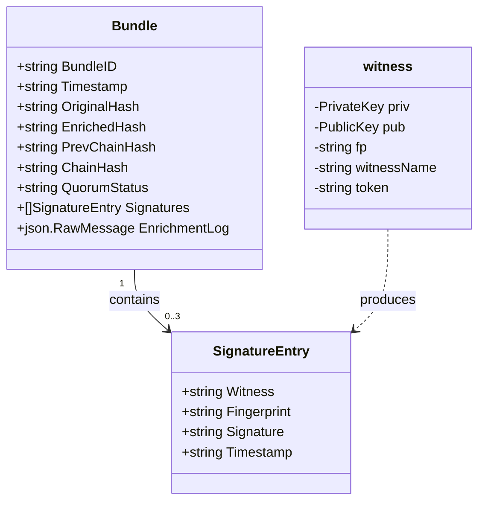

---

## 🔍 Real Code — `cmd/gateway/main.go` Lines 34–51

```go
// SignatureEntry — one witness's cryptographic signature
type SignatureEntry struct {
    Witness     string `json:"witness"`      // "alpha", "beta", or "gamma"
    Fingerprint string `json:"fingerprint"`  // SHA-256 fingerprint of the public key
    Signature   string `json:"signature"`    // The actual Ed25519 signature (base64)
    Timestamp   string `json:"timestamp"`    // When the witness signed
}

// Bundle — the complete proof record for one bank transaction
type Bundle struct {
    BundleID      string          `json:"bundle_id"`
    Timestamp     string          `json:"timestamp"`
    OriginalHash  string          `json:"original_hash"`
    EnrichedHash  string          `json:"enriched_hash"`
    PrevChainHash string          `json:"prev_chain_hash"`
    ChainHash     string          `json:"chain_hash"`
    Signatures    []SignatureEntry `json:"signatures"`    // A LIST of signatures
    QuorumStatus  string          `json:"quorum_status"`
    EnrichmentLog json.RawMessage `json:"enrichment_log"`
}
```

**Anatomy of one field — broken apart:**

```
    BundleID          string          `json:"bundle_id"`
    ────────          ──────          ──────────────────
       │                │                     │
    Field name       Data type           Struct tag:
    (Go code uses    (this field          When json.Marshal
    this name)       holds text)          writes this to JSON,
                                          call it "bundle_id"
                                          not "BundleID"
```

**Uppercase vs lowercase field names:**

```
  type Bundle struct {          type witness struct {
      BundleID string               priv ed25519.PrivateKey
      ────────                      ────
      UPPERCASE = Public            lowercase = Private
      Any code anywhere             Only code INSIDE this
      can read this field           package can access this
  }                             }

  WHY: The private key must NEVER leak outside the witness package.
       Making it lowercase enforces this at the language level.
```

---

## ❓ Ask Why?

- **Why** does `Signatures` use `[]SignatureEntry` instead of just `string`?
- **Why** does the `Bundle` struct have both `OriginalHash` AND `EnrichedHash`?

*(Answer #2: The `OriginalHash` is the fingerprint of the raw legacy ISO 8583 message that came in. The `EnrichedHash` is the fingerprint of the translated ISO 20022 XML that went out. Storing both proves the translation was faithful — the two hashes chain together into `ChainHash`, which witnesses sign.)*

---

## ✏️ Quiz 3

Create `sandbox/quiz3.go`:

1. Define a struct `BankTransaction` with JSON tags:

| Field | Type | JSON Tag |
|-------|------|----------|
| `ID` | `string` | `"id"` |
| `SenderBank` | `string` | `"sender_bank"` |
| `ReceiverBank` | `string` | `"receiver_bank"` |
| `AmountKES` | `float64` | `"amount_kes"` |
| `IsApproved` | `bool` | `"is_approved"` |

2. Create one transaction with realistic values
3. Use `json.Marshal` to convert it to JSON and print it

---

## ✅ Answer — Quiz 3

```go
package main

import (
    "encoding/json"
    "fmt"
)

type BankTransaction struct {
    ID           string  `json:"id"`
    SenderBank   string  `json:"sender_bank"`
    ReceiverBank string  `json:"receiver_bank"`
    AmountKES    float64 `json:"amount_kes"`
    IsApproved   bool    `json:"is_approved"`
}

func main() {
    tx := BankTransaction{
        ID:           "TX-2026-001",
        SenderBank:   "KCB Bank",
        ReceiverBank: "Equity Bank",
        AmountKES:    15750.00,
        IsApproved:   true,
    }

    jsonBytes, err := json.Marshal(tx)
    if err != nil {
        fmt.Println("Error:", err)
        return
    }
    fmt.Println(string(jsonBytes))
}
```

**What happens inside `json.Marshal`:**

```
  BankTransaction struct            JSON output
  ─────────────────────            ────────────────────────────────────────
  ID:           "TX-2026-001"  →   "id":            "TX-2026-001"
  SenderBank:   "KCB Bank"     →   "sender_bank":   "KCB Bank"
  ReceiverBank: "Equity Bank"  →   "receiver_bank": "Equity Bank"
  AmountKES:    15750.00       →   "amount_kes":    15750
  IsApproved:   true           →   "is_approved":   true
                                                     ▲
  The struct tag renames                        struct tag
  the field in the output                       did this
```

**Expected output:**
```json
{"id":"TX-2026-001","sender_bank":"KCB Bank","receiver_bank":"Equity Bank","amount_kes":15750,"is_approved":true}
```

---

---

# Chapter 4: Functions — Reusable Recipes

---

## 📖 The Analogy

```
  WITHOUT functions:                WITH functions:
  ──────────────────                ────────────────
  hash TX-001:                      func sha256Hex(data) {
    h = sha256(TX-001)                  h = sha256(data)
    return hex(h)                       return hex(h)
                                    }
  hash TX-002:
    h = sha256(TX-002)              sha256Hex(TX-001)  ← one line
    return hex(h)                   sha256Hex(TX-002)  ← one line
                                    sha256Hex(TX-003)  ← one line
  hash TX-003:
    h = sha256(TX-003)              Write once. Call everywhere.
    return hex(h)

  ❌ Repeated 10,000 times          ✅ Written once, used 10,000 times
```

---

## Function Anatomy — Visual

```
  func  sha256Hex  (data []byte)  string  {
  ────  ─────────  ────────────   ──────
   │       │            │           │
   │    Name of      Parameter:   Return
   │    the recipe   ingredient   type:
   │                 named "data" gives back
  keyword            of type      a string
  that starts        []byte
  a recipe
```

---

## How Functions Call Each Other in CONNEX

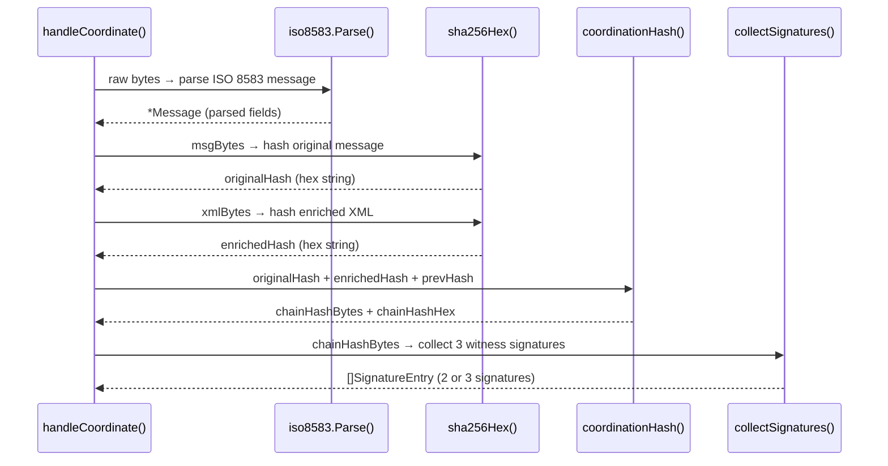

Every arrow in that diagram is a function calling another function. `sha256Hex` is called **twice** for every single transaction.

---

## 🔍 Real Code — `cmd/gateway/main.go` Lines 125–128

```go
func sha256Hex(data []byte) string {
    h := sha256.Sum256(data)        // Compute the hash. h is of type [32]byte
    return hex.EncodeToString(h[:]) // h[:] converts [32]byte to []byte, then hex encode
}
```

**What happens inside, step by step:**

```
  Input:  "Alice sends 1000 KES to Bob"  (as []byte)
      │
      ▼
  sha256.Sum256(data)
      │
      ▼
  h = [32]byte{0xd5, 0x03, 0xff, 0xab, ...}  ← 32 raw bytes
      │
      ▼
  h[:]  ← convert fixed-size [32]byte array to flexible []byte slice
      │
      ▼
  hex.EncodeToString(...)
      │
      ▼
  Output: "d503ffab67cf2bdb4a8a1f4c33827a2..."  ← 64-character hex string

  Change even ONE character of the input and the output is completely different.
  This is how tampering is detected.
```

---

## 🔍 Real Code — Multiple Return Values

```go
// Returns THREE values: public key, private key, error
func loadOrGenerate(keyPath string) (ed25519.PublicKey, ed25519.PrivateKey, error) {
    // ...
    return pub, priv, nil   // nil = no error
}

// The caller receives all three:
pub, priv, err := loadOrGenerate(*keyPath)
// ─── ──── ─── ─────────────────────────
//  1    2    3  ← positions match the return types exactly
```

**The `_` trick — discard what you don't need:**

```go
pub, _, err := loadOrGenerate(*keyPath)
//   │
//   └── The underscore _ means "I know there's a value here but I don't need it"
//       Go will not complain about unused variables when you use _
```

---

## ✏️ Quiz 4

Create `sandbox/quiz4.go`. Write two functions:

**`hashText(input string) string`**
- Converts string to bytes: `[]byte(input)`
- Hashes it: `sha256.Sum256(...)`
- Returns the hex string

**`makeTransactionID(bankCode string, seq int) string`**
- Returns: `"TX-KCB-042-20260527"` format
- Zero-pad the number to 3 digits using `%03d`
- Use today's date with `time.Now().Format("20060102")`

---

## ✅ Answer — Quiz 4

```go
package main

import (
    "crypto/sha256"
    "encoding/hex"
    "fmt"
    "time"
)

func hashText(input string) string {
    h := sha256.Sum256([]byte(input)) // []byte() converts string to raw bytes
    return hex.EncodeToString(h[:])   // h[:] converts [32]byte array to a slice
}

func makeTransactionID(bankCode string, seq int) string {
    today := time.Now().Format("20060102") // Format: YYYYMMDD
    return fmt.Sprintf("TX-%s-%03d-%s", bankCode, seq, today)
    // %03d = minimum 3 digits, zero-padded: 42 → "042", 7 → "007"
}

func main() {
    hash := hashText("Hello CONNEX")
    fmt.Println("SHA-256:", hash)

    txID := makeTransactionID("KCB", 42)
    fmt.Println("Transaction ID:", txID)
}
```

**Expected output:**
```
SHA-256: 3b5d5c3712955042212316173ccf37be9baaea1bc23b9f1ec95b938db4c4d96c
Transaction ID: TX-KCB-042-20260527
```

---

---

## 🔄 Review Checkpoint 2

Answer from memory:

1. Write `sha256Hex` from memory — just the 3 lines inside the function.
2. What does `h[:]` do and why is it needed?
3. What does `_` mean when receiving return values?
4. What is a struct tag? Write one example.
5. What is the difference between `string` and `[]byte`?

---

---

# Chapter 5: Methods — Functions That Belong to a Struct

---

## 📖 The Analogy

```
  Regular function:            Method on a struct:
  ─────────────────            ───────────────────
  sha256Hex(data)              bundle.ChainSummary()
  │                            │
  You pass the data in.        The bundle IS the context.
                               It operates on its own fields.

  Like asking:                 Like asking:
  "Hash this data"             "Bundle, summarize yourself"
```

The difference in code:

```
  func sha256Hex(data []byte) string {   ← regular function, takes data as a parameter

  func (b *Bundle) Summary() string {    ← method, "b" is this specific bundle
      return b.BundleID + ": " + b.QuorumStatus
  }                                      ← access fields with "b."
```

---

## HTTP Request Flow Through a Method

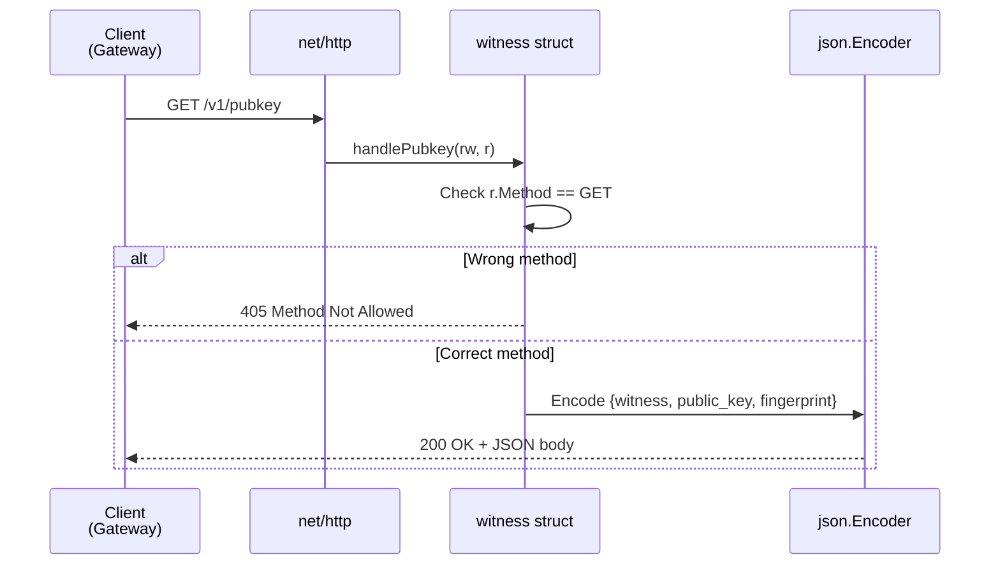

---

## 🔍 Real Code — `cmd/witness/main.go` Lines 82–93

```go
func (w *witness) handlePubkey(rw http.ResponseWriter, r *http.Request) {
//   ──────────── 
//   receiver: this method belongs to the "witness" struct
//   "w" is how we refer to THIS specific witness inside this function

    if r.Method != http.MethodGet {
        http.Error(rw, "GET required", http.StatusMethodNotAllowed)
        return  // Stop here — don't continue
    }

    rw.Header().Set("Content-Type", "application/json")

    json.NewEncoder(rw).Encode(map[string]string{
        "witness":     w.witnessName,                          // ← w. accesses the struct
        "public_key":  base64.StdEncoding.EncodeToString(w.pub),
        "fingerprint": w.fp,
    })
}
```

---

## 🔍 Real Code — `internal/iso8583/parser.go` Lines 91–101

```go
func (m *Message) AmountKES() float64 {
    s, ok := m.Fields[4]     // m.Fields is a map. Look up key "4" (the amount field)
    if !ok || s == "" {      // If key "4" not found, or it is blank...
        return 0             // ...amount is zero
    }
    n, err := strconv.ParseInt(strings.TrimLeft(s, "0 "), 10, 64)
    if err != nil {
        return 0
    }
    return float64(n) / 100.0
}
```

**Why divide by 100?**

```
  ISO 8583 stores money in CENTS (no decimal point):

  Raw field 4 value:  "000000100000"
                       ────────────
                       12 digits, zero-padded

  After TrimLeft:     "100000"   (removes leading zeros)
  After ParseInt:     100000     (integer: one hundred thousand cents)
  After / 100.0:      1000.00    (float64: one thousand KES)

  So "000000100000" in ISO 8583 = 1000.00 KES ✓
```

---

## ✏️ Quiz 5

Create `sandbox/quiz5.go`. Add two methods to `BankTransaction`:

**`Summary() string`** → returns:
`"TX-ID: [ID] | [SenderBank] → [ReceiverBank] | KES [AmountKES]"`

**`IsLargeTransaction() bool`** → returns `true` if `AmountKES > 100000`

In `main()`, create a transaction with amount `250000` and call both methods.

---

## ✅ Answer — Quiz 5

```go
package main

import "fmt"

type BankTransaction struct {
    ID           string
    SenderBank   string
    ReceiverBank string
    AmountKES    float64
    IsApproved   bool
}

func (t *BankTransaction) Summary() string {
    return fmt.Sprintf("TX-ID: %s | %s → %s | KES %.2f",
        t.ID, t.SenderBank, t.ReceiverBank, t.AmountKES)
}

func (t *BankTransaction) IsLargeTransaction() bool {
    return t.AmountKES > 100000
}

func main() {
    tx := &BankTransaction{
        ID:           "TX-2026-099",
        SenderBank:   "KCB Bank",
        ReceiverBank: "Equity Bank",
        AmountKES:    250000.00,
        IsApproved:   true,
    }

    fmt.Println(tx.Summary())

    if tx.IsLargeTransaction() {
        fmt.Println("⚠️  ALERT: Large transaction — flagged for compliance review")
    } else {
        fmt.Println("✅  Standard transaction cleared")
    }
}
```

**Expected output:**
```
TX-ID: TX-2026-099 | KCB Bank → Equity Bank | KES 250000.00
⚠️  ALERT: Large transaction — flagged for compliance review
```

---

---

# Chapter 6: Error Handling — Never Let Problems Go Silent

---

## 📖 The Analogy

```
  Imagine a bank teller who processes a transaction,
  the system rejects it internally, but the teller
  smiles and hands you a receipt saying "APPROVED."

  That is a catastrophe. In banking, silence = fraud risk.

  Go's rule: If a function CAN fail, it MUST tell you.
  Your rule:  If a function CAN fail, you MUST check it.
```

---

## The Error Handling Pattern — Visual

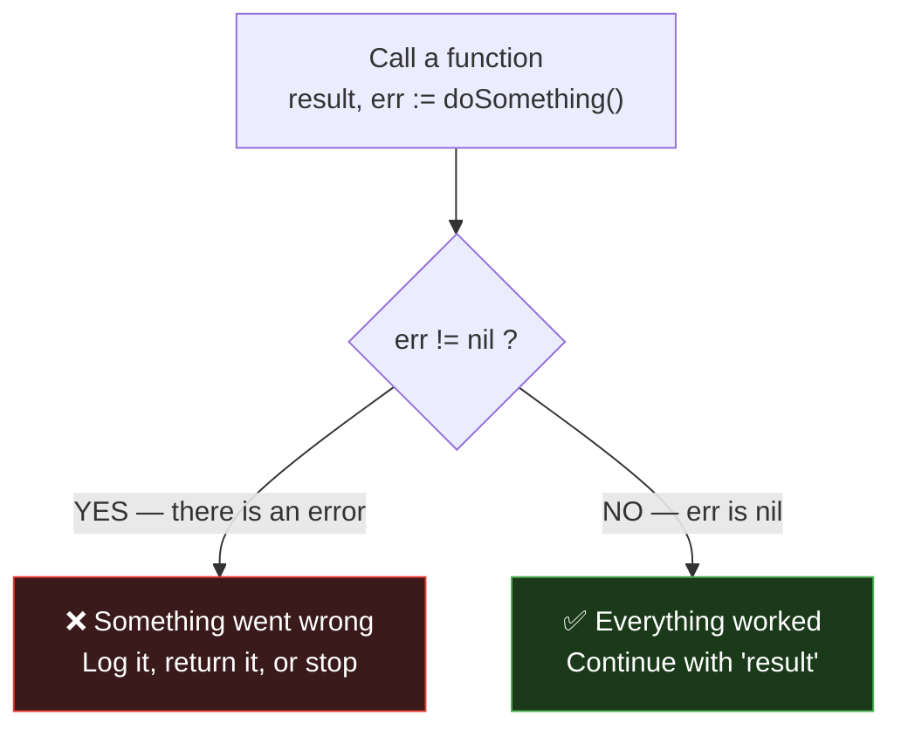

---

## How Errors Chain in CONNEX

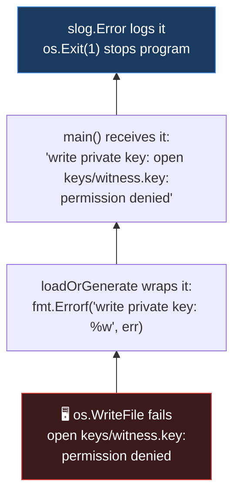

The `%w` verb in `fmt.Errorf` **wraps** the error — it attaches the new message to the original, creating a chain. When you look at the final error, you see the full trail of what went wrong and where.

---

## 🔍 Real Code — `cmd/witness/main.go` Lines 47–63

```go
pub, priv, err := ed25519.GenerateKey(rand.Reader)
if err != nil {
    return nil, nil, fmt.Errorf("generate keypair: %w", err)
    //                           ───────────────    ──
    //                           context label      %w wraps the original error
}

// 0600 = file permissions: owner can read+write, nobody else can do anything
if err := os.WriteFile(privPath, priv, 0600); err != nil {
    return nil, nil, fmt.Errorf("write private key: %w", err)
}

// 0644 = file permissions: owner can write, everyone can read
if err := os.WriteFile(pubPath, pub, 0644); err != nil {
    return nil, nil, fmt.Errorf("write public key: %w", err)
}
```

**File permission cheat sheet:**

```
  0600  →  rw-------  →  Owner: read+write | Group: none | Others: none
  0644  →  rw-r--r--  →  Owner: read+write | Group: read | Others: read
  0700  →  rwx------  →  Owner: all        | Group: none | Others: none

  Private key = 0600  (the most secret — only YOU can touch it)
  Public key  = 0644  (meant to be shared — anyone can read it)
```

---

## ✏️ Quiz 6

Create `sandbox/quiz6.go`. Write `readTransactionFile(filename string) (string, error)`:
1. Call `os.ReadFile(filename)`
2. On failure → return `""` and `fmt.Errorf("readTransactionFile: %w", err)`
3. On success → return `string(data)` and `nil`

Call it in `main()` with a file that does not exist and print the error.

---

## ✅ Answer — Quiz 6

```go
package main

import (
    "fmt"
    "os"
)

func readTransactionFile(filename string) (string, error) {
    data, err := os.ReadFile(filename)
    if err != nil {
        return "", fmt.Errorf("readTransactionFile: %w", err)
    }
    return string(data), nil
}

func main() {
    content, err := readTransactionFile("transactions.json")
    if err != nil {
        fmt.Println("Failed to load:", err)
        return
    }
    fmt.Println("File contents:", content)
}
```

**Expected output:**
```
Failed to load: readTransactionFile: open transactions.json: The system cannot find the file specified.
```

The error chain: your label → OS error. This is what makes production debugging fast.

---

---

## 🔄 Review Checkpoint 3

Answer from memory:

1. What does `nil` mean when it is the value of an `error`?
2. What does `%w` do that `%v` does not?
3. What is the difference between file permissions `0600` and `0644`?
4. Write the 3-line pattern for calling a function and checking its error.
5. In `func (m *Message) AmountKES()`, what does the `*` before `Message` mean?

---

---

# Chapter 7: Goroutines — Running Code Simultaneously

---

## 📖 The Analogy

```
  You need signatures from 3 bank officers: Alpha, Beta, Gamma.

  SEQUENTIAL (bad):                    PARALLEL with goroutines (good):
  ─────────────────                    ────────────────────────────────
  Walk to Alpha → wait → sign          Send all 3 requests at once:
  Walk to Beta  → wait → sign
  Walk to Gamma → wait → sign          Alpha ──────────┐
                                       Beta  ───────────┼──→ all working at the same time
  Total: 150ms                         Gamma ────────────┘
                                       Total: ~50ms (fastest wins the deadline)
```

---

## Sequential vs Parallel — Timeline

```mermaid
gantt
    title Transaction Signing: Sequential vs Parallel
    dateFormat X
    axisFormat %Lms

    section Sequential (150ms total)
    Ask Witness Alpha  :crit, s1, 0, 50
    Ask Witness Beta   :crit, s2, 50, 100
    Ask Witness Gamma  :crit, s3, 100, 150

    section Parallel with Goroutines (~50ms total)
    Ask Witness Alpha  :active, p1, 0, 50
    Ask Witness Beta   :active, p2, 0, 50
    Ask Witness Gamma  :active, p3, 0, 50
```

---

## Goroutines + Channels — How They Communicate

```
  GOROUTINE                         MAIN CODE
  ─────────                         ─────────
  Does its work in background       Waits for results
                │                         │
                │  ch <- result{sig, err} │
                └──────────────────────►  │  r := <-ch
                      the CHANNEL         │  (receive result)
                      (the pipe)

  Three goroutines, one channel:

  Goroutine Alpha ──┐
                    │
  Goroutine Beta  ──┼──► ch (channel pipe) ──► main code collects results
                    │
  Goroutine Gamma ──┘
```

---

## 🔍 Real Code — `cmd/gateway/main.go` Lines 87–121

```go
func collectSignatures(witnesses []string, tokens []string, hashBytes []byte, timeout time.Duration) []SignatureEntry {

    // A mini-struct to hold one goroutine's result (success OR error)
    type result struct {
        sig *SignatureEntry
        err error
    }

    // Create the channel — a buffered pipe for len(witnesses) results
    ch := make(chan result, len(witnesses))

    // Launch ONE goroutine per witness — all 3 start SIMULTANEOUSLY
    for i, w := range witnesses {
        w := w  // ← IMPORTANT: capture the loop variable for this goroutine
        var token string
        if i < len(tokens) {
            token = tokens[i]
        }
        go func() {                                   // ← "go" = launch in background NOW
            sig, err := requestSignature(w, token, hashBytes, timeout)
            ch <- result{sig, err}                    // ← push result into the pipe
        }()
    }

    var sigs []SignatureEntry
    deadline := time.After(timeout)                   // ← countdown timer

    for range witnesses {
        select {
        case r := <-ch:                               // ← a result arrived
            if r.err != nil {
                slog.Warn("witness error", "err", r.err)
            } else {
                sigs = append(sigs, *r.sig)
            }
        case <-deadline:                              // ← timer ran out
            slog.Warn("witness timeout reached", "collected", len(sigs))
            return sigs
        }
    }
    return sigs
}
```

**Why `w := w` before the goroutine?**

```
  WITHOUT w := w:           WITH w := w:
  ───────────────           ────────────
  Loop runs 3 times.        Loop runs 3 times.
  All 3 goroutines          Each goroutine gets
  share the SAME "w"        its OWN private copy
  variable. By the          of "w". They cannot
  time they run, "w"        interfere with each
  might be "gamma"          other.
  for all three! ❌          ✓
```

---

## How quorum works — the `select` statement


---

## ✏️ Quiz 7

Create `sandbox/quiz7.go`. Simulate 3 witnesses:

1. `results := make(chan string, 3)`
2. Launch 3 goroutines: sleep 1s/2s/5s, then send `"Alpha signed ✓"` / `"Beta signed ✓"` / `"Gamma signed ✓"`
3. Loop 3 times with `select`:
   - Receive from channel → print message, increment counter
   - `time.After(3 * time.Second)` → print `"⏰ Timeout"`, check quorum, return

---

## ✅ Answer — Quiz 7

```go
package main

import (
    "fmt"
    "time"
)

func main() {
    results := make(chan string, 3)

    go func() { time.Sleep(1 * time.Second); results <- "Alpha signed ✓" }()
    go func() { time.Sleep(2 * time.Second); results <- "Beta signed ✓" }()
    go func() { time.Sleep(5 * time.Second); results <- "Gamma signed ✓" }() // Too slow

    collected := 0
    for i := 0; i < 3; i++ {
        select {
        case msg := <-results:
            fmt.Println("Received:", msg)
            collected++
        case <-time.After(3 * time.Second):
            fmt.Println("⏰ Timeout — witness did not respond in time")
            if collected >= 2 {
                fmt.Printf("✅ QUORUM_MET — %d/3 signatures collected\n", collected)
            } else {
                fmt.Printf("❌ QUORUM_FAILED — only %d/3 signatures\n", collected)
            }
            return
        }
    }
}
```

**Expected output:**
```
Received: Alpha signed ✓
Received: Beta signed ✓
⏰ Timeout — witness did not respond in time
✅ QUORUM_MET — 2/3 signatures collected
```

This mirrors what the real CONNEX Gateway outputs when Witness Gamma is offline.

---

---

## 🔄 Review Checkpoint 4 — Interleaved (All Chapters Mixed)

Answer from memory — these questions mix all 7 chapters deliberately:

1. **(Ch.1)** What happens if you `import "fmt"` and never use `fmt` in your code?
2. **(Ch.2)** What is the difference between `string` and `[]byte`?
3. **(Ch.3)** What does lowercase field names in a struct mean vs uppercase?
4. **(Ch.4)** Write the 3-line `sha256Hex` function completely from memory.
5. **(Ch.5)** In `func (m *Message) AmountKES() float64`, what does `*` mean?
6. **(Ch.6)** What does `fmt.Errorf("context: %w", err)` do differently than `%v`?
7. **(Ch.7)** What is a channel? What do `<-` and `->` do?

---

---

# Chapter 8: The Full Picture — A Transaction From Start to Finish

---

## Every Step a Bank Transaction Takes in CONNEX

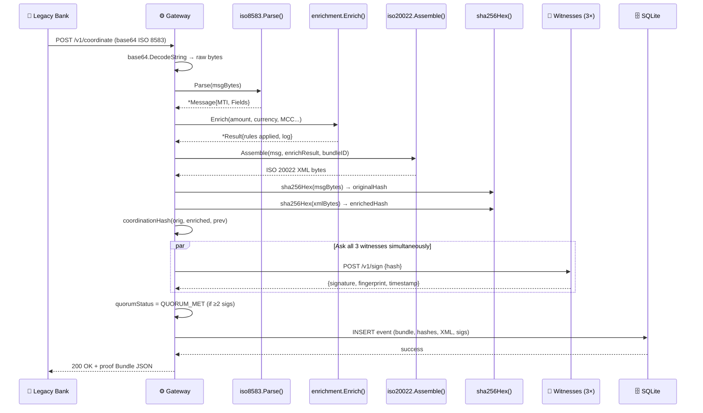

---

## The Complete CONNEX Code Map

```
  c:\Users\roych\OFFICIAL MVP\
  ├── cmd\
  │   ├── gateway\main.go     ← Chapter 1,2,3,4,5,6,7 all used here
  │   └── witness\main.go     ← Chapter 1,2,3,4,5,6 used here
  │
  ├── internal\
  │   ├── iso8583\parser.go   ← Chapter 3 (Message struct), 5 (AmountKES method)
  │   ├── iso20022\           ← Chapter 4 (Assemble function)
  │   ├── enrichment\         ← Chapter 3 (Input/Result structs), 4 (Enrich function)
  │   └── storage\            ← Chapter 3 (Event struct), 5 (DB methods)
  │
  └── docs\
      └── GO_COURSE.md        ← You are here
```

---

## Now Read The Real Code

Open `cmd/gateway/main.go`. Find `handleCoordinate()` at line 148. It has **12 numbered steps** in the comments. For each step, identify which chapter from this course that code comes from.

```
  Step 1:  Read and decode base64 body         → Chapter ___
  Step 2:  Parse ISO 8583                       → Chapter ___
  Step 3:  Run enrichment engine               → Chapter ___
  Step 4:  Generate bundle ID                   → Chapter ___
  Step 5:  Compute hashes                       → Chapter ___
  Step 6:  Lock coordination (sync.Mutex)       → Chapter ___
  Step 7:  Compute coordination hash            → Chapter ___
  Step 8:  Collect witness signatures           → Chapter ___ ← this is Chapter 7!
  Step 9:  Build enrichment log JSON            → Chapter ___
  Step 10: Assemble proof bundle               → Chapter ___
  Step 11: Write to SQLite                      → Chapter ___
  Step 12: Return bundle JSON                   → Chapter ___
```

When you can fill in all 12 blanks, you are ready to contribute to CONNEX.

---

## 📅 Recommended Study Schedule

```
  ┌─────────┬────────────────────────────────────────────────────────┐
  │  Day 1  │  Chapters 1–2, Quizzes 1–2                             │
  │  Day 2  │  Review Checkpoint 1, Chapter 3, Quiz 3               │
  │  Day 3  │  Chapters 4–5, Quizzes 4–5, Review Checkpoint 2       │
  │  Day 5  │  Re-do Quizzes 1–3 from memory (spaced repetition)    │
  │  Day 6  │  Chapters 6–7, Quizzes 6–7, Review Checkpoint 3       │
  │  Day 7  │  Chapter 8 Final Challenge + Review Checkpoint 4       │
  │  Day 10 │  Re-do ALL 7 quizzes from memory                       │
  │  Day 14 │  Read cmd/gateway/main.go top to bottom, annotate it  │
  └─────────┴────────────────────────────────────────────────────────┘

  Research finding: 1 focused hour per day beats 7 hours in one sitting.
```
