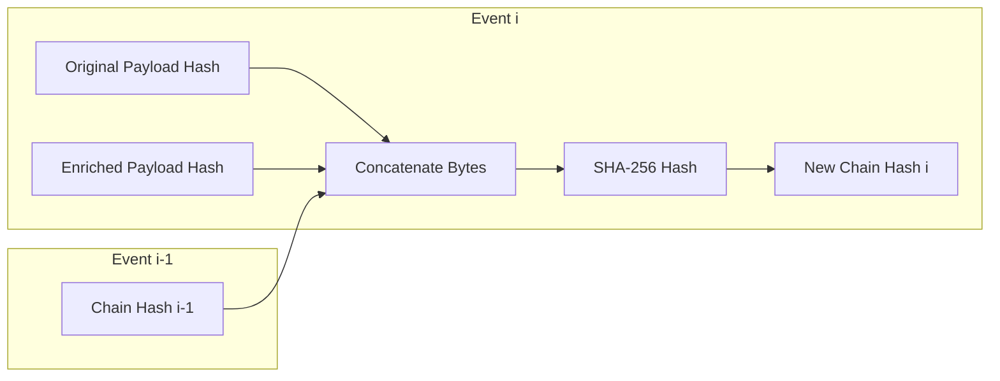

<picture>
  <source media="(prefers-color-scheme: dark)" srcset="connex_logo_dark.png">
  <source media="(prefers-color-scheme: light)" srcset="connex_logo_light.png">
  
</picture>

---

# SQLite Storage & Hash-Chain Integrity

This document explains the Connex Storage Layer (`internal/storage/`) and how the system guarantees the mathematical and operational integrity of the transaction ledger. We will explore database setup, trigger-enforced immutability, cryptographic hash chaining, and concurrency controls.

---

## 1. SQLite Engine Configuration

Connex uses SQLite as its core ledger database via the `modernc.org/sqlite` Go driver (a pure Go port that doesn't require CGO). 

When opening a connection, the system configures SQLite with specific performance and safety settings:

```go
conn, err := sql.Open("sqlite", path+"?_journal=WAL&_busy_timeout=5000")
```

### WAL (Write-Ahead Logging) Mode
- **Traditional Rollback Journal**: Blocks readers while writing.
- **WAL Mode**: Readers and writers do not block each other. Writers append to a separate WAL log, while readers read from the database file simultaneously. This enables high concurrency under load.

### Busy Timeout (`_busy_timeout=5000`)
If another thread holds a write lock on the database, the system will wait up to 5000 milliseconds (5 seconds) for it to unlock before returning a `database is locked` error.

---

## 2. Ledger Schema & Append-Only Triggers

The schema is defined in [schema.sql](file:///c:/Users/roych/OFFICIAL%20MVP/internal/storage/schema.sql). It features an auto-incrementing sequence index:

```sql
CREATE TABLE IF NOT EXISTS coordination_events (
    sequence_id      INTEGER PRIMARY KEY AUTOINCREMENT,
    bundle_id        TEXT UNIQUE NOT NULL,
    timestamp        TEXT NOT NULL,
    original_hash    TEXT NOT NULL,   -- hex SHA-256 of raw ISO 8583 bytes
    enriched_hash    TEXT NOT NULL,   -- hex SHA-256 of enriched XML bytes
    chain_hash       TEXT NOT NULL,   -- hex SHA-256(original||enriched||prev)
    prev_chain_hash  TEXT NOT NULL,   -- chain_hash of the previous event
    bundle_json      TEXT NOT NULL,   -- full proof bundle as JSON
    enriched_xml     TEXT NOT NULL,   -- validated pacs.008 XML
    enrichment_log   TEXT NOT NULL,   -- JSON engine details
    quorum_status    TEXT NOT NULL    -- QUORUM_MET | QUORUM_FAILED
);
```

### 2.1 The Sequence Index
Historically, databases used text timestamps to order events. This is fragile: system clocks can drift, run backward, or experience microsecond collisions. 
Connex uses `sequence_id INTEGER PRIMARY KEY AUTOINCREMENT`. This guarantees that SQLite assigns a monotonically increasing integer index to each record. To get the latest block in the chain, we query:
```sql
SELECT chain_hash FROM coordination_events ORDER BY sequence_id DESC LIMIT 1
```

### 2.2 Database-Level Append-Only Enforcement
To ensure that records cannot be modified (tampered with) or deleted—even if someone gains administrator access to the application or runs manual SQL queries—we register SQLite **triggers**:

```sql
CREATE TRIGGER IF NOT EXISTS no_update
BEFORE UPDATE ON coordination_events
BEGIN
    SELECT RAISE(ABORT, 'coordination_events is append-only: UPDATE rejected');
END;

CREATE TRIGGER IF NOT EXISTS no_delete
BEFORE DELETE ON coordination_events
BEGIN
    SELECT RAISE(ABORT, 'coordination_events is append-only: DELETE rejected');
END;
```
If any update or delete statement is executed, SQLite halts execution immediately and raises an error.

---

## 3. Cryptographic Hash Chaining

The cornerstone of the ledger's integrity is a **Hash Chain**. Each event contains a mathematical link to the event that came before it, forming an unbroken cryptographic sequence.

### The Hash Chain Equation
The hash of block $i$ (denoted as $H_{\text{chain}}^{(i)}$) is calculated by concatenating the hash of the original ISO 8583 message ($H_{\text{original}}$), the hash of the generated XML ($H_{\text{enriched}}$), and the hash of the previous ledger block ($H_{\text{chain}}^{(i-1)}$), and hashing the combined bytes:

$$H_{\text{chain}}^{(i)} = \text{SHA-256}\left( H_{\text{original}}^{(i)} \parallel H_{\text{enriched}}^{(i)} \parallel H_{\text{chain}}^{(i-1)} \right)$$



### The Genesis Block (Initial State)
For the very first event in the database, there is no previous event. The system handles this by using a genesis constant: 64 zero hex characters (`0` repeated 32 times in raw bytes).

---

## 4. Concurrency Protection (Preventing Forks)

If two transactions arrive at the gateway at the exact same millisecond, they might both read the same `LatestChainHash` (e.g. Block $X$). They would then compute their respective next hashes pointing to $X$, and attempt to write them. This would result in a **chain fork** (two blocks claiming to be the immediate successor of block $X$).

To prevent this, the gateway coordinates entries using a mutex lock (`sync.Mutex`):

```go
type gateway struct {
    db *storage.DB
    mu sync.Mutex // protects coordination chain updates
}

func (g *gateway) handleCoordinate(w http.ResponseWriter, r *http.Request) {
    ...
    // 1. Lock coordination sequence to prevent parallel hash chain branching
    g.mu.Lock()
    defer g.mu.Unlock() // runs automatically when handleCoordinate exits

    // 2. Query latest hash
    prevHash, _ := g.db.LatestChainHash()

    // 3. Compute new hash
    chainHashBytes, chainHashHex := coordinationHash(originalHash, enrichedHash, prevHash)

    // 4. Collect signatures and build proof bundle
    ...

    // 5. Write to SQLite synchronously (guarantee write completes before unlock)
    err = g.db.Insert(...)
    if err != nil {
        // Return 500 error, sequence is rolled back in SQLite automatically
    }
}
```

By placing the Mutex lock across the entire read-compute-write sequence, we guarantee that only one thread can query the DB and write the next block at a time, ensuring a perfectly linear transaction ledger.
