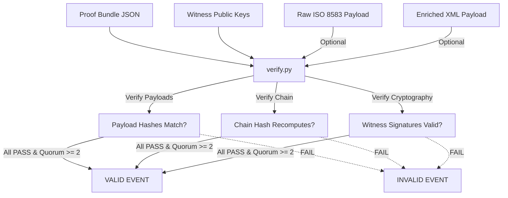

<picture>
  <source media="(prefers-color-scheme: dark)" srcset="connex_logo_dark.png">
  <source media="(prefers-color-scheme: light)" srcset="connex_logo_light.png">
  
</picture>

---

# Independent Verification & Audit Flow

This document details the mechanics of the Connex transaction verifier script (`verify/verify.py`). It explains how a third-party auditor can verify a transaction bundle's integrity using only the witness public keys, without depending on the gateway server or database.

---

## 1. The Verification Paradigm

One of the key security features of Connex is **auditable proof**. The gateway issues a JSON transaction proof bundle for every transaction. This bundle can be audited by third parties (like clients, compliance teams, or central banks) to prove that:
- The transaction content has not been tampered with.
- A quorum of witnesses signed the coordination hash.
- The transaction is securely chained to the previous transaction.



---

## 2. Python Verifier Setup

The verification script [verify.py](file:///c:/Users/roych/OFFICIAL%20MVP/verify/verify.py) is written in Python 3. It utilizes the **PyNaCl** library (a Python wrapper around the libsodium cryptography library) to verify Ed25519 signatures.

### Installation
```bash
pip install pynacl
```

### Script Execution
The script is run from the command line:
```bash
python verify/verify.py <bundle_path> <keys_dir> [raw_iso_path] [enriched_xml_path]
```

---

## 3. Step-by-Step Verification Stages

Here is the exact algorithmic sequence executed by the Python verifier:

### Stage 1: Optional Payload Hash Audits
If paths to the original files are provided, the verifier computes their hashes and compares them to the hashes recorded in the bundle:
```python
# Compute local hash of the original ISO 8583 byte content
iso_hash = get_payload_hash(raw_iso_path, is_base64=True)
if iso_hash != bundle["original_hash"]:
    raise ValueError("Payload hash mismatch!")
```
This ensures that the gateway did not alter the transaction payload after securing consensus.

### Stage 2: Recompute the Coordination Hash
The verifier recomputes the coordination hash from its three core ingredients and verifies it matches the `chain_hash` inside the bundle:

```python
def recompute_chain_hash(original_hash_hex: str,
                         enriched_hash_hex: str,
                         prev_hash_hex: str) -> bytes:
    original = bytes.fromhex(original_hash_hex)
    enriched = bytes.fromhex(enriched_hash_hex)
    prev     = bytes.fromhex(prev_hash_hex)
    return hashlib.sha256(original + enriched + prev).digest()

computed = recompute_chain_hash(
    bundle["original_hash"],
    bundle["enriched_hash"],
    bundle["prev_chain_hash"],
)
if computed.hex() != bundle["chain_hash"]:
    print("INVALID: Hash mismatch - data has been tampered!")
```

### Stage 3: Load Witness Public Keys
To verify witness signatures, the verifier needs the corresponding public keys. It searches a directory for public key files ending in `.pub`. To link a signature in the bundle to a key file, it compares fingerprints:

```python
def find_public_key(keys_dir: Path, fingerprint: str) -> bytes | None:
    for pub_file in keys_dir.rglob("*.pub"):
        raw = pub_file.read_bytes()
        if len(raw) != 32: # Ed25519 public keys are exactly 32 bytes
            continue
        fp = hashlib.sha256(raw).hexdigest()[:16] # First 16 hex chars
        if fp == fingerprint:
            return raw
    return None
```

### Stage 4: Cryptographic Bound-Timestamp Signature Auditing
For each signature entry in the bundle:
1.  It retrieves the public key matching the fingerprint.
2.  It re-constructs the witness-bound message by appending the signature timestamp to the computed chain hash:
    $$H_{\text{witness}} = \text{SHA-256}(H_{\text{chain}} \parallel \text{timestamp})$$
3.  It calls PyNaCl's `VerifyKey.verify` to check that the witness private key signed this exact hash.

```python
# Reconstruct the timestamp-bound hash
witness_hash = hashlib.sha256(computed + timestamp.encode('utf-8')).digest()

# Perform Ed25519 signature validation
vk = nacl.signing.VerifyKey(pub_bytes)
vk.verify(witness_hash, signature_bytes)
print("Signature is valid!")
```

### Stage 5: Quorum Consensus Auditing
The verifier counts the number of valid signatures. If the count is $\ge 2$, it prints a success message and exits with status code `0`. If fewer than 2 signatures are valid, it prints a failure message and exits with status code `1`.

---

## 4. Replicating the Verifier (Beginner Guide)

To write a verifier in another language (such as Go, TypeScript, or Rust):
1.  **Strict Bytes Concatenation**: When recomputing hashes or signatures, make sure you concatenate the raw bytes. When hashing strings, encode them explicitly to UTF-8.
2.  **Hex vs Base64**: Be careful with encodings:
    - Payload hashes and chain hashes are represented as hexadecimal strings.
    - Witness public keys and signatures are represented as Base64 strings.
3.  **Timestamp Formats**: High-precision timestamps (`2006-01-02T15:04:05.999999999Z`) must be verified exactly as strings. Do not parse them to local datetimes before verification, as representation changes (e.g. dropping trailing zeros) will change the byte length and cause verification to fail.
