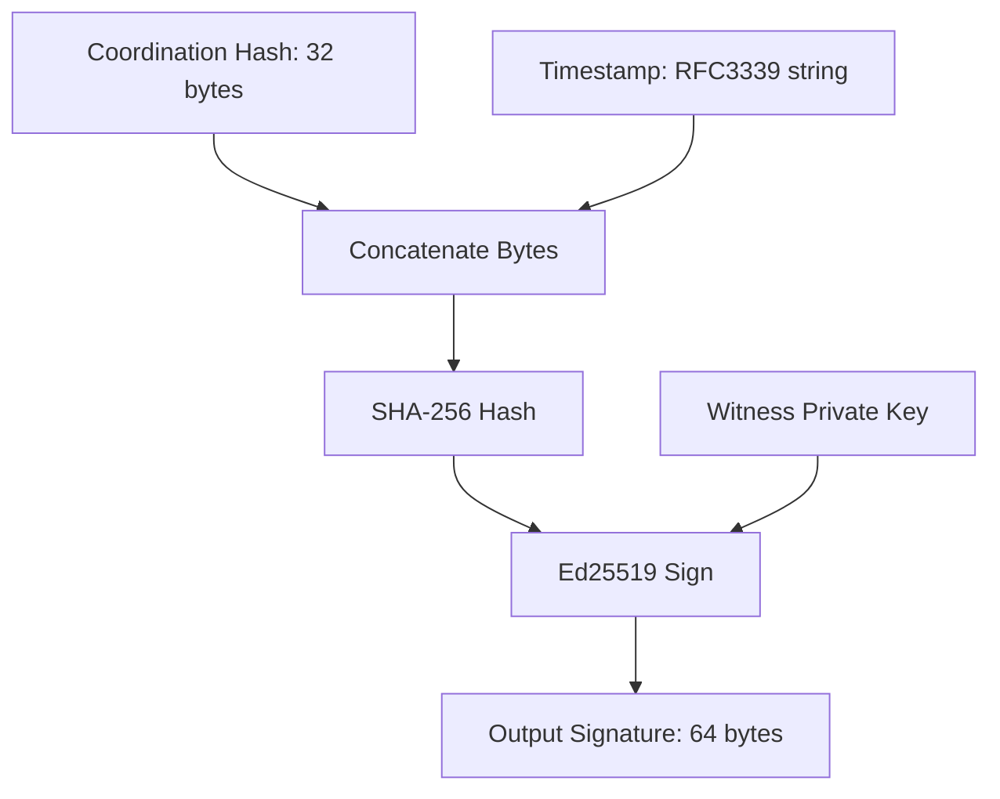

<picture>
  <source media="(prefers-color-scheme: dark)" srcset="connex_logo_dark.png">
  <source media="(prefers-color-scheme: light)" srcset="connex_logo_light.png">
  
</picture>

---

# Witness Cryptographic Security & APIs

This document details the security and cryptographic design of the Connex Witness Node (`cmd/witness/`). It explains how witness keys are managed, how the cryptographic bound-timestamp signature prevents attacks, and how to verify these signatures.

---

## 1. Witness Key Management

Each witness node is an isolated validator running on its own server port or network domain. When a witness starts up, it must have access to an **Ed25519 signature key pair**. 

### 1.1 Why Ed25519?
- **Speed**: Signature generation and verification are extremely fast.
- **Key Sizes**: Small public keys (32 bytes) and signatures (64 bytes), making network payloads compact.
- **Safety**: Robust against common implementation pitfalls (like side-channel attacks).

### 1.2 Key Initialization (`loadOrGenerate`)
On startup, the witness checks if a private key file exists at the path specified by the `--keypath` flag:
- If present, it loads the key pair.
- If missing, it generates a fresh pair and writes them to disk.
- **File Permissions**: The private key is saved with file mode `0600` (readable/writable only by the owner process), and the public key is saved with mode `0644` (readable by everyone).

### 1.3 Key Fingerprints
To identify witnesses without transmitting large public key strings, the system computes a short **fingerprint**:
- The public key is hashed using `SHA-256`.
- The first 16 characters (8 bytes) of the resulting hex string are used as the fingerprint.
- **Example Fingerprint**: `a5b7c8d9e0f1a2b3`.

---

## 2. API Endpoints & Access Control

The witness exposes three HTTP endpoints:
1.  **`GET /health`**: Returns the health status, name, and key fingerprint.
2.  **`GET /v1/pubkey`**: Returns the public key (base64-encoded) and fingerprint.
3.  **`POST /v1/sign`**: Receives a transaction coordination hash and returns a signature.

### Bearer Token Authorization
To prevent unauthorized parties from calling the signing endpoint, the witness accepts a `--token` configuration flag. If set, the witness audits every incoming request header:

```go
if w.token != "" {
    auth := r.Header.Get("Authorization")
    expected := "Bearer " + w.token
    if auth != expected {
        http.Error(rw, "Unauthorized", http.StatusUnauthorized)
        return
    }
}
```
If the token is missing or incorrect, the witness rejects the request with HTTP `401 Unauthorized` and does not sign the transaction.

---

## 3. Cryptographic Bound-Timestamp Signatures

In simple cryptographic designs, a signer signs only the raw hash of a payload ($H_{\text{coord}}$). However, this leaves the system vulnerable to **timestamp forgery**: a compromised gateway could alter the transaction execution timestamp in its database while re-using the witness's original signature.

### The Mitigation: Bind the Timestamp to the Signature
To prevent this, the witness generates a high-precision UTC timestamp at the exact millisecond it receives the signing request. It then hashes the coordination hash and the timestamp bytes *together* before signing:

$$H_{\text{witness}} = \text{SHA-256}\left( H_{\text{coord}} \parallel \text{timestamp} \right)$$

$$\text{Signature} = \text{Ed25519Sign}\left( \text{PrivateKey}_{\text{witness}}, H_{\text{witness}} \right)$$



The witness returns both the `signature` (base64) and the raw `timestamp` string in its JSON response. 

---

## 4. Witness Client implementation in the Gateway

The gateway coordinates signature requests to all witnesses concurrently. It reads the incoming witnesses from CLI flags, loads their token secrets, and maps them to request calls.

Here is the helper function `requestSignature` in [main.go](file:///c:/Users/roych/OFFICIAL%20MVP/cmd/gateway/main.go):

```go
func requestSignature(addr string, token string, hashBytes []byte, timeout time.Duration) (*SignatureEntry, error) {
    // 1. Package the 32-byte hash as Base64 JSON
    body, _ := json.Marshal(map[string]string{
        "hash": base64.StdEncoding.EncodeToString(hashBytes),
    })
    
    // 2. Set timeout limit (150ms)
    client := &http.Client{Timeout: timeout}
    req, err := http.NewRequest("POST", addr+"/v1/sign", bytes.NewReader(body))
    if err != nil {
        return nil, err
    }
    
    // 3. Set standard Content-Type and Bearer auth headers
    req.Header.Set("Content-Type", "application/json")
    if token != "" {
        req.Header.Set("Authorization", "Bearer "+token)
    }
    
    // 4. Send request and decode response
    resp, err := client.Do(req)
    if err != nil {
        return nil, err
    }
    defer resp.Body.Close()
    
    if resp.StatusCode != http.StatusOK {
        return nil, fmt.Errorf("witness returned %d", resp.StatusCode)
    }
    
    var sig SignatureEntry
    if err := json.NewDecoder(resp.Body).Decode(&sig); err != nil {
        return nil, fmt.Errorf("decode signature response: %w", err)
    }
    return &sig, nil
}
```
If the gateway collects at least 2 signatures from different witnesses, the bundle status is marked as `QUORUM_MET` and returned to the client.
